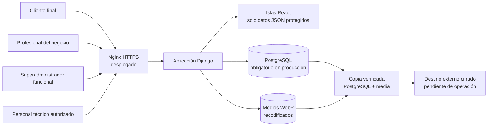

# Seguridad y protección de datos

## Propósito y alcance

Este documento reúne las medidas de seguridad aplicadas en AgendaSalon y las
evidencias que permiten verificarlas. Está preparado como base del apartado de
seguridad de la memoria del Proyecto Fin de Máster.

La revisión distingue tres estados:

- **Aplicado y verificado**: el control está implementado y dispone de pruebas o
  comprobaciones reproducibles.
- **Verificado en despliegue**: el control se ha comprobado también sobre la URL
  pública con HTTPS.
- **Pendiente de operación**: depende de infraestructura, automatización o
  procedimientos que no deben fingirse en el entorno local.

Fecha de la evidencia: **14 de julio de 2026**.

Código funcional revisado: commit `cba4690` de la rama principal y despliegue
público del 14 de julio de 2026.

## Arquitectura de seguridad



La aplicación separa cuatro superficies:

1. **Reserva pública por negocio**: permite explorar servicios y huecos sin
   mostrar la agenda interna. Exige una cuenta de cliente para confirmar.
2. **Panel profesional**: opera exclusivamente sobre el negocio asociado a la
   pertenencia activa del usuario.
3. **Panel superadministrador**: gestiona el ciclo de vida de los negocios, pero
   no actúa como profesional ni entra en la reserva de sus clientes.
4. **Django Admin**: herramienta técnica bajo `/admin/`, separada del producto y
   reservada a cuentas `is_staff` con permisos de modelo.

## Matriz de controles y evidencias

| Área | Control aplicado | Evidencia principal | Estado |
| --- | --- | --- | --- |
| Autenticación interna | Usuario Django propio con teléfono normalizado, sesión de Django y acceso condicionado por rol y pertenencia activa | `apps/accounts/`, `apps/accounts/tests.py` | Aplicado y verificado |
| Autenticación cliente | Cuenta ligada a una ficha y a un negocio; sesión separada, rotación al entrar y salir y caducidad tras una hora de inactividad | `apps/customers/services.py`, `apps/customers/tests.py` | Aplicado y verificado |
| Hashing | Argon2id como algoritmo preferente; actualización transparente de hashes PBKDF2 después de un acceso correcto | `config/settings/base.py`, pruebas de `apps/customers/tests.py` | Aplicado y verificado |
| Contraseñas | Mínimo de 12 caracteres y validadores de similitud, contraseñas comunes y valores exclusivamente numéricos | `config/settings/base.py`, formularios y pruebas de acceso | Aplicado y verificado |
| Activación profesional | Los accesos nuevos permanecen inactivos y sin contraseña utilizable hasta que la persona abre un enlace de un solo uso, verifica su correo y crea su propia contraseña; la contraseña temporal queda limitada a compatibilidad heredada | `apps/accounts`, `apps/notifications`, middleware, formularios y pruebas | Aplicado y verificado |
| Verificación de correo | Profesionales y clientes deben verificar una dirección normalizada y única antes de utilizar la operativa protegida o reservar; los enlaces tienen caducidad y no se almacenan en claro | `apps/accounts`, `apps/customers`, `apps/notifications` y pruebas | Aplicado y verificado |
| Fuerza bruta | Limitación por identidad e IP; claves seudonimizadas con HMAC-SHA-256 y limpieza operativa de contadores inactivos | `apps/core/security_throttle.py`, `prune_security_throttles` | Aplicado y verificado |
| Recuperación de acceso cliente | Invitación aleatoria de un solo uso, ligada a negocio y ficha, caducidad de 24 horas y token almacenado solo como resumen SHA-256 | `apps/customers/services.py`, `apps/customers/tests.py` | Aplicado y verificado |
| Autorización | Decoradores de acceso, comprobación de negocio activo y filtrado de objetos por empresa | vistas, API y pruebas de aislamiento | Aplicado y verificado |
| Aislamiento multiempresa | Los endpoints profesionales resuelven el negocio desde la sesión; no confían en un identificador de empresa enviado por el navegador | `apps/booking/api.py`, `apps/dashboards/api.py`, pruebas por negocio | Aplicado y verificado |
| CSRF | `CsrfViewMiddleware`, token en formularios y mutaciones mediante POST; pantalla de rechazo sin detalles internos | `config/settings/base.py`, plantillas y prueba CSRF real de activación | Aplicado y verificado |
| XSS y contenido activo | Autoescape de plantillas, ausencia de inserciones HTML inseguras en el código de producto y CSP con scripts limitados al mismo origen | `apps/core/middleware.py`, `config/settings/base.py` | Aplicado y verificado |
| Cabeceras de navegador | `Permissions-Policy`, CORP `same-origin`, bloqueo de marcos y objetos mediante CSP | middleware y pruebas de cabeceras | Aplicado y verificado |
| Validación | Formularios Django, `full_clean()`, normalización de teléfonos, restricciones de modelos y mensajes genéricos en accesos sensibles | formularios, modelos y 243 pruebas Django | Aplicado y verificado |
| Integridad de citas | Revalidación del hueco antes de guardar, transacciones atómicas y bloqueo de filas en transiciones concurrentes | `apps/booking/services.py`, `test_postgres_concurrency.py` | Aplicado y verificado |
| Subida de imágenes | JPG, PNG o WebP; 5 MB y 16 millones de píxeles; orientación, reducción a 2400 px y recodificación WebP sin EXIF | `apps/businesses/images.py`, pruebas de ajustes | Aplicado y verificado |
| Galería pública por negocio | Las imágenes propias se relacionan con un único negocio y el formulario solo permite seleccionar archivos de esa misma empresa | `BusinessPublicImage`, formulario de ajustes y pruebas de aislamiento | Aplicado y verificado |
| Secretos | Variables de entorno obligatorias en producción; arranque detenido si faltan secreto, hosts o PostgreSQL | `config/settings/prod.py`, `.env.example`, pruebas de producción | Aplicado y verificado |
| Base de datos | SQLite solo para desarrollo; PostgreSQL obligatorio en producción, conexión persistente con comprobación de salud | `config/settings/database.py`, `config/settings/prod.py` | Aplicado y verificado |
| HTTPS | Redirección a HTTPS, cookies seguras, orígenes CSRF configurables y HSTS inicial | `config/settings/prod.py` y validación pública del 14-07-2026 | Verificado en despliegue |
| Dependencias | Versiones fijadas; auditorías Python y Node sin vulnerabilidades conocidas en la fecha de revisión | `requirements.txt`, `package-lock.json`, comandos de evidencia | Aplicado y verificado |
| Copias | Copia diaria de PostgreSQL y `media`, hashes SHA-256, manifiesto HMAC, retención 7/4/6 y control de frescura inferior a 36 horas | `ops/backup_restore.py`, `ops/test_backup_restore.py`, `ops/systemd/` | Verificado en despliegue |
| Destino externo de copias | Retención definida y requisito de almacenamiento cifrado fuera del servidor | `docs/OPERACION_PRODUCCION.md` | Pendiente de operación |

## Autenticación, sesiones y contraseñas

El acceso profesional y superadministrador utiliza el sistema de autenticación
de Django sobre un usuario personalizado. El teléfono se normaliza antes de
identificar la cuenta, evitando que diferentes formatos representen identidades
distintas.

Los clientes no comparten una cuenta global entre salones. Cada acceso queda
ligado a un negocio y a una ficha concreta. El registro público solo crea fichas
nuevas: si el teléfono ya existe, responde con un mensaje genérico y exige una
invitación emitida por el profesional. Así se evita que una persona se apropie
de una ficha existente conociendo únicamente su número.

Las contraseñas nuevas se almacenan con Argon2id. Django conserva PBKDF2 como
algoritmo compatible para poder verificar cuentas antiguas y actualizar su hash
después de un acceso correcto. Nunca se guardan contraseñas en claro.

La contraseña creada durante el alta superadministradora es temporal. Un
indicador persistente y un middleware situado antes del onboarding legal impiden
entrar en agenda, clientes o configuración hasta que la persona defina una clave
propia. `Mi cuenta` permite cambios posteriores verificando la contraseña actual
y rechazando una nueva contraseña idéntica. `update_session_auth_hash()` conserva
la sesión presente; el cambio del hash de contraseña invalida las demás sesiones.
Los parámetros de retorno se validan contra el host y esquema actuales para
evitar redirecciones externas.

Las sesiones usan cookies `HttpOnly` y `SameSite=Lax`. En producción se marcan
además como `Secure`. La sesión cliente rota su identificador al entrar y salir,
y el acceso caduca tras una hora sin actividad.

## Autorización y aislamiento por negocio

AgendaSalon aplica autorización en dos capas:

- la ruta exige una sesión y un rol válidos;
- cada consulta limita los objetos al negocio resuelto desde la pertenencia del
  usuario o desde el slug público correspondiente.

Las islas React no reciben acceso directo a la base de datos. Consumen endpoints
JSON de solo lectura, protegidos por sesión y con política de no caché. El
identificador del negocio no se acepta como fuente de autorización desde el
navegador.

El panel superadministrador y Django Admin no son equivalentes. El primero
pertenece al producto. El segundo es una consola técnica de mantenimiento: una
cuenta `is_staff` puede entrar, pero Django limita después cada modelo por
permisos; solo el superusuario dispone de acceso completo.

## CSRF, XSS y cabeceras

Todas las mutaciones construidas utilizan POST y token CSRF. El middleware de
Django valida el origen y el token antes de ejecutar la acción. Una prueba con
comprobación CSRF real cubre el flujo de activación por invitación.

Las plantillas utilizan el escape automático de Django. La revisión del código
no encuentra `mark_safe`, filtros `safe`, `dangerouslySetInnerHTML`, `innerHTML`,
`eval` ni ejecución dinámica equivalente en las superficies del producto.

La CSP de producto restringe scripts, conexiones, formularios y recursos al
mismo origen, salvo las fuentes declaradas. Bloquea objetos, marcos y atributos
JavaScript. Django Admin mantiene una excepción `unsafe-inline` únicamente para
scripts bajo `/admin/`, necesaria para su interfaz actual; esta excepción no se
propaga a profesionales ni clientes.

El producto todavía permite estilos inline para soportar valores visuales
calculados en algunas plantillas. Esta concesión no habilita scripts inline y
queda registrada como endurecimiento futuro de la CSP.

## Validación e integridad de la agenda

Los formularios y modelos validan tipos, longitudes, formatos, pertenencia y
reglas de negocio. Los números se normalizan, las citas usan fechas conscientes
de zona horaria y las restricciones de base de datos refuerzan las invariantes
que no deben depender solo de la interfaz.

La disponibilidad mostrada no garantiza por sí sola una reserva. Antes de crear
una cita, el servicio de dominio vuelve a calcular el hueco y lo bloquea dentro
de una transacción. En PostgreSQL, las transiciones concurrentes de una cita
usan `select_for_update()`. La prueba concurrente confirma que dos operaciones
incompatibles no pueden cerrar la misma cita con resultados distintos.

## Gestión de secretos y configuración de producción

El perfil `config.settings.prod` falla de forma explícita si no recibe:

- `DJANGO_SECRET_KEY`;
- `DJANGO_ALLOWED_HOSTS`;
- `DJANGO_DATABASE_URL`.

También exige declarar el contexto legal. Con
`AGENDA_PLATFORM_LEGAL_DEMO=1`, la aplicación se identifica como demostración
académica sin actividad comercial, exige nombre visible, correo y web, y obliga
a mantener vacíos NIF y domicilio para no inventarlos ni exponer datos
personales. Con `AGENDA_PLATFORM_LEGAL_DEMO=0`, el modo comercial continúa
exigiendo la identidad completa y real. La elección no relaja ninguna medida
técnica del perfil de producción.

PostgreSQL es obligatorio en producción. La URL de conexión se obtiene del
entorno y no se pasa a la herramienta de copias mediante argumentos visibles en
la lista de procesos. `.env.example` contiene únicamente nombres y ejemplos sin
credenciales reales. Gitleaks no detectó secretos en el historial Git completo
existente en la fecha de revisión ni en los cambios preparados del bloque de
cierre.

## HTTPS: configuración y evidencia pública verificadas

El perfil de producción activa:

- redirección obligatoria a HTTPS;
- cookies de sesión y CSRF seguras;
- HSTS inicial de 60 segundos e inclusión de subdominios;
- `upgrade-insecure-requests` dentro de la CSP;
- lista explícita de hosts y orígenes CSRF.

HTTPS está validado en `agendasalon.brvsoftwarestudio.com`: certificado vigente,
redirección desde HTTP, cookies y cabeceras seguras, recursos estáticos y flujos
de acceso y reserva. `SECURE_HSTS_PRELOAD` permanece desactivado de manera
deliberada. El preload no debe activarse hasta sostener la estabilidad del
dominio y revisar el efecto sobre todos sus subdominios.

## Copias de seguridad y recuperación

La herramienta `ops/backup_restore.py` crea un volcado PostgreSQL, un archivo de
medios y un manifiesto con sumas SHA-256 autenticado con una clave HMAC separada
del almacenamiento. La restauración verifica primero integridad y autenticidad,
exige una confirmación explícita y no sobrescribe medios existentes
silenciosamente.

El ensayo realizado en PostgreSQL 17 restauró una copia en una base limpia y
comparó los recuentos de 2 negocios, 19 citas y 7 clientes. Los objetivos
iniciales son RPO de 24 horas, RTO inferior a 2 horas y retención de 7 copias
diarias, 4 semanales y 6 mensuales.

La primera copia local autenticada y verificada se creó en el despliegue y un
temporizador persistente programa su ejecución diaria. La retención 7/4/6 se
aplica únicamente después de verificar todas las copias gestionadas. Un segundo
temporizador falla si no existe una copia auténtica, íntegra y con menos de 36
horas, y una vigilancia local informa a Fran ante fallos o poco espacio. Estas
medidas quedaron verificadas sobre el Droplet el 14 de julio de 2026. El destino
externo cifrado continúa pendiente; por tanto, la continuidad externa todavía
no está cerrada.

## Protección y minimización de datos

AgendaSalon trata datos identificativos y de contacto necesarios para gestionar
citas. El MVP excluye datos sanitarios. Las notas internas se limitan a
información operativa y no deben utilizarse para almacenar información sensible.

El historial de actividad conserva trazabilidad de acciones sin guardar
contraseñas, tokens en claro ni datos personales innecesarios. La actividad
global del superadministrador no muestra nombres ni teléfonos de clientes.
Las reservas públicas registran el actor genérico `Cliente online` y omiten del
detalle de cambios los nombres de quien solicita o recibe la cita. La migración
`businesses.0009` aplica la misma minimización a los eventos públicos ya
existentes, sin alterar la ficha de cita que necesita el profesional.

La solicitud pública de alta profesional aplica minimización propia: no pide
contraseña, NIF, razón social, dirección completa, horarios, servicios, clientes
ni datos de pago. Conserva el documento de privacidad, su versión, huella y fecha
de lectura. El teléfono se normaliza, los reenvíos equivalentes no duplican una
solicitud abierta y los POST se limitan por teléfono e IP mediante claves
resumidas. Los datos recibidos solo aparecen en la zona superadministradora y no
se copian como contacto público del negocio sin una decisión expresa.

Estas medidas técnicas no sustituyen las obligaciones jurídicas de una
explotación comercial. La publicación académica no debe usarse con actividad
comercial ni datos de clientes reales. Antes de activar ese uso deben cerrarse
identidad fiscal real, política de privacidad, base jurídica, información al
usuario, contratos con encargados, plazos definitivos de conservación y
procedimiento de ejercicio de derechos.

## Evidencias reproducibles

Los siguientes comandos se ejecutaron sobre el código funcional el 13 de julio
de 2026:

```powershell
.\.venv\Scripts\coverage.exe run manage.py test
.\.venv\Scripts\coverage.exe report
npm.cmd run check
.\.venv\Scripts\ruff.exe check .
.\.venv\Scripts\python.exe manage.py check
.\.venv\Scripts\python.exe manage.py makemigrations --check --dry-run
.\.venv\Scripts\python.exe -m pip_audit
npm.cmd audit --audit-level=low
gitleaks detect --source . --no-banner --redact --exit-code 1
```

| Comprobación | Resultado |
| --- | --- |
| Suite Django en SQLite | 252 pruebas descubiertas; 5 omitidas por requerir PostgreSQL |
| Suite Django en PostgreSQL 17 | 252 pruebas correctas, incluida concurrencia real |
| Cobertura con ramas | 82 %; puerta mínima automatizada del 82 % |
| Suite frontend | 21 pruebas correctas: 17 unitarias y 4 de componentes React |
| Build Vite | Correcto; 19 módulos transformados |
| `manage.py check` | Sin incidencias |
| Migraciones | No se detectaron cambios pendientes |
| `pip-audit` | Sin vulnerabilidades conocidas |
| `npm audit` | 0 vulnerabilidades conocidas |
| Gitleaks 8.30.1 | Historial Git completo y cambios preparados revisados; sin secretos detectados |
| PostgreSQL 17 | Suite completa de 252 pruebas correcta, incluida concurrencia real |
| CI | GitHub Actions: Ruff, migraciones, cobertura, SQLite, PostgreSQL, frontend, auditorías y Gitleaks |
| Copia y restauración | Restauración completa en base limpia con recuentos coincidentes |

El chequeo de producción se ejecutó con valores locales temporales, sin
credenciales reales y sin conectar servicios externos:

```powershell
.\.venv\Scripts\python.exe manage.py check --deploy --settings=config.settings.prod
```

Resultado: una única advertencia, `security.W021`, porque HSTS preload permanece
desactivado hasta disponer de dominio y HTTPS estables.

## Correcciones derivadas del escáner de 13 de julio de 2026

El escáner estándar sellado identificó tres hallazgos bajos y los tres quedan
corregidos en esta versión:

1. La admisión de autenticación reserva de forma atómica los límites de sujeto
   e IP antes de ejecutar Argon2. Los bloqueos se adquieren en orden
   determinista y una autenticación correcta no borra reservas posteriores.
2. Cada negocio retiene como máximo doce imágenes públicas. Como cada salida
   WebP está limitada a 5 MB, el presupuesto agregado queda acotado a 60 MB.
   La comprobación y la creación se serializan sobre la fila del negocio y un
   rollback elimina cualquier archivo ya escrito.
3. Pausar o reactivar un contacto autorizado no reescribe la concesión de
   reserva. Un permiso asociado a contacto solo es efectivo cuando la concesión
   y el contacto están activos; una revocación explícita sobrevive a la
   reactivación.

La reproducción concurrente en PostgreSQL admite exactamente cinco
comprobaciones para doce solicitudes del mismo sujeto y treinta para treinta y
seis sujetos bajo una misma IP. Dos cargas que compiten por el último hueco de
galería conservan una sola. Los PoCs originales confirman el cierre: el de
permisos termina en `PASS` y el que exigía aceptar trece imágenes falla en la
decimotercera solicitud, como corresponde al nuevo control.

## Riesgos residuales y puertas antes de producción

| Riesgo residual | Prioridad | Decisión o condición de cierre |
| --- | --- | --- |
| HTTPS público | Cerrado para la demo | Certificado válido, redirección HTTP, cabeceras, acceso y reserva comprobados en `agendasalon.brvsoftwarestudio.com` |
| Terminación TLS del proxy | Cerrado para la demo | Nginx sobrescribe `X-Forwarded-Proto`, Gunicorn solo escucha en socket y Django confía únicamente en el proxy local declarado |
| Copias sin destino externo cifrado | Alta para continuidad; bloqueante para explotación comercial | La retención 7/4/6 y la vigilancia local están activas; falta elegir el destino externo y repetir una restauración desde él |
| Django Admin accesible desde Internet | Alta | Restringir por red, VPN o IP y usar cuentas técnicas personales con privilegios mínimos |
| Sin segundo factor para cuentas técnicas | Alta para explotación comercial | Incorporar MFA o proteger el acceso mediante identidad del proveedor o VPN |
| Galería limitada a 12 archivos, pero sin límite temporal de subidas | Media | Añadir límite por cuenta o proxy; pasar el procesamiento a un worker si aumenta el volumen |
| Sin monitorización central de toda la plataforma | Media | La vigilancia de copias y disco ya avisa localmente; falta centralizar disponibilidad, errores y logs del conjunto |
| `unsafe-inline` en scripts de Django Admin | Media y acotada | Mantener la excepción solo en `/admin/` y revisar nonce o hash si se personaliza la consola |
| Estilos inline permitidos en el producto | Baja | Sustituir valores inline por clases o variables controladas y retirar progresivamente `unsafe-inline` de las directivas de estilo |
| Política de privacidad y conservación definitiva no cerradas | Bloqueante para uso real con clientes | Completar la capa jurídica y operativa antes de recopilar datos reales |
| Modo académico utilizado para una actividad comercial | Bloqueante para uso real | Mantener la demo sin actividad comercial ni clientes reales; pasar a modo comercial solo con identidad legal real y revisión jurídica |

## Veredicto

AgendaSalon supera el alcance técnico exigible para explicar autenticación,
hashing, validación, CSRF, XSS, permisos, secretos y copias de seguridad. Los
controles de aplicación están implementados y respaldados por pruebas.

La aplicación está publicada como **demo académica** y HTTPS, proxy, aislamiento,
copias locales, retención y vigilancia de frescura disponen de evidencia en el
entorno definitivo. No debe presentarse como **lista para explotación
comercial**: el destino externo de copias, la monitorización central, el acceso
técnico reforzado y las obligaciones jurídicas reales siguen pendientes.

El superadministrador dispone ahora de un estado de continuidad verificable y
un historial técnico de solo lectura. Esta visibilidad no cierra el riesgo
residual: mientras no exista una ejecución reciente declarada como externa y
verificada, la propia interfaz mantiene visibles la programación y el destino
externo como pendiente de operación.
