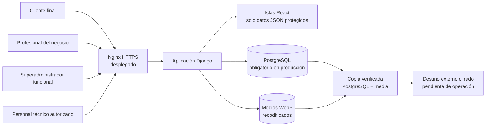

# Seguridad y protección de datos

## Propósito y alcance

Este documento reúne las medidas de seguridad aplicadas en AgendaSalon y las
evidencias que permiten verificarlas. Está preparado como base del apartado de
seguridad de la memoria del Proyecto Fin de Máster.

La revisión distingue tres estados:

- **Aplicado y verificado**: el control está implementado y dispone de pruebas o
  comprobaciones reproducibles.
- **Verificado en despliegue**: el control se ha comprobado también sobre la URL
  pública con HTTPS.
- **Pendiente de operación**: depende de infraestructura, automatización o
  procedimientos que no deben fingirse en el entorno local.

Fecha de la evidencia local más reciente: **17 de julio de 2026**.

La evidencia de publicación no se infiere de la fecha de este documento: debe
comprobarse por SHA exacto, resultado de CI y registro operativo del despliegue.

> **Bloque correctivo P0 verificado en local.** Las reglas descritas como P0 ya
> superan la batería completa, cobertura, frontend, build, comprobaciones
> estáticas y QA visual aislada sin alterar la base canónica. Estas cifras
> describen la evidencia local; el estado publicado se acredita por separado
> para el SHA exacto en CI y en la documentación operativa.

> **Bloque P1 verificado en local.** Recibos legales exactos, libros de eventos,
> administración técnica de solo lectura, idempotencia UUID, `lease` con latido
> de correo, exclusión mutua BOE y formularios CSRF con política de referencia
> diferenciada superan la matriz local completa. P1 todavía no está publicada:
> producción continúa en P0, SHA
> `5c68a260d1d87ed00c908d25bf519c3f34fea712`.

## Arquitectura de seguridad



La aplicación separa cuatro superficies:

1. **Reserva pública por negocio**: permite explorar servicios y huecos sin
   mostrar la agenda interna. Exige una cuenta de cliente para confirmar.
2. **Panel profesional**: opera exclusivamente sobre el negocio asociado a la
   pertenencia activa del usuario.
3. **Panel superadministrador**: gestiona el ciclo de vida de los negocios, pero
   no actúa como profesional ni entra en la reserva de sus clientes.
4. **Django Admin**: herramienta técnica bajo `/admin/`, separada del producto y
   reservada a cuentas `is_staff` con permisos de modelo.

## Matriz de controles y evidencias

| Área | Control aplicado | Evidencia principal | Estado |
| --- | --- | --- | --- |
| Autenticación interna | Usuario Django propio con teléfono normalizado, sesión de Django y acceso condicionado por rol y pertenencia activa | `apps/accounts/`, `apps/accounts/tests.py` | Aplicado y verificado |
| Autenticación cliente | Cuenta ligada a una ficha y a un negocio; correo verificado como identidad canónica, teléfono solo como contacto o compatibilidad cuando no es ambiguo; sesión separada con rotación, caducidad y huella de contraseña | `apps/customers/services.py`, `apps/customers/views.py` | P0 verificado en local; sujeto a CI por SHA |
| Hashing | Argon2id como algoritmo preferente; actualización transparente de hashes PBKDF2 después de un acceso correcto | `config/settings/base.py`, pruebas de `apps/customers/tests.py` | Aplicado y verificado |
| Contraseñas | Mínimo de 12 caracteres y validadores de similitud, contraseñas comunes y valores exclusivamente numéricos | `config/settings/base.py`, formularios y pruebas de acceso | Aplicado y verificado |
| Activación profesional | Los accesos nuevos permanecen inactivos y sin contraseña utilizable hasta que la persona abre un enlace de un solo uso, verifica su correo y crea su propia contraseña; la contraseña temporal queda limitada a compatibilidad heredada | `apps/accounts`, `apps/notifications`, middleware, formularios y pruebas | Aplicado y verificado |
| Verificación de correo cliente | El alta y la invitación dejan el acceso sin contraseña utilizable; GET solo valida y presenta, y POST con CSRF confirma el correo, la privacidad aplicable y la clave; el alta pública mantiene ficha inactiva y `is_pending_public_registration` hasta completar ese POST | `apps/customers`, `apps/notifications` | P0 verificado en local; sujeto a CI por SHA |
| Fuerza bruta y enumeración | Limitación por identidad e IP con claves seudonimizadas; alta, reenvío y recuperación aplican esperas o cupos y respuestas genéricas que no confirman cuentas | `apps/core/security_throttle.py`, `apps/customers` | P0 verificado en local; sujeto a CI por SHA |
| Invitación cliente | Token aleatorio de un solo uso, ligado a negocio y ficha, caducidad de 24 horas y almacenamiento exclusivo de su resumen SHA-256 | `apps/customers/services.py` | P0 verificado en local; sujeto a CI por SHA |
| Recuperación de contraseña cliente | Solicitud por correo verificado con respuesta genérica; enlace firmado, ligado al negocio y a la huella de contraseña, con caducidad de 60 minutos e invalidación tras cambiar la clave | `apps/customers`, `apps/notifications` | P0 verificado en local; sujeto a CI por SHA |
| Autorización | Decoradores de acceso, negocio activo en la operativa y filtrado de objetos por empresa; privacidad y derechos son la excepción legal explícita durante una pausa | vistas, API y pruebas de aislamiento | P0 verificado en local; sujeto a CI por SHA |
| Aislamiento multiempresa | Los endpoints profesionales resuelven el negocio desde la sesión; no confían en un identificador de empresa enviado por el navegador | `apps/booking/api.py`, `apps/dashboards/api.py`, pruebas por negocio | Aplicado y verificado |
| CSRF | `CsrfViewMiddleware`, token en formularios y mutaciones mediante POST; los GET de activación profesional y de alta, invitación o recuperación cliente solo validan o presentan. La verificación de correo profesional aún consume el token mediante GET y queda registrada para migrarla a POST con CSRF en P2. Las respuestas con POST usan `same-origin` o, si la URL contiene un token, `strict-origin`, para conservar un `Origin` válido sin filtrar esa ruta | `config/settings/base.py`, plantillas, vistas y pruebas con CSRF real | P1 verificado en local con la excepción profesional declarada; sujeto a CI por SHA |
| XSS y contenido activo | Autoescape de plantillas, ausencia de inserciones HTML inseguras en el código de producto y CSP con scripts limitados al mismo origen | `apps/core/middleware.py`, `config/settings/base.py` | Aplicado y verificado |
| Cabeceras de navegador | `Permissions-Policy`, CORP `same-origin`, bloqueo de marcos y objetos mediante CSP y política de referencia diferenciada entre formularios POST y respuestas de token sin formulario | middleware, vistas y pruebas de cabeceras | Aplicado y verificado |
| Validación | Formularios Django, `full_clean()`, normalización de teléfonos, restricciones de modelos y mensajes genéricos en accesos sensibles | formularios, modelos y batería Django de 534 pruebas | Aplicado y verificado en local |
| Integridad de citas | Revalidación del hueco, duraciones compatibles con el intervalo, cierre solo tras `ends_at` y bloqueos comunes entre confirmación y mutaciones profesionales de horarios, cierres, preferencia de festivos o líneas | `apps/booking/services.py`, modelos y vistas | P0 verificado en local; sujeto a CI por SHA |
| Idempotencia de reserva pública | Cada borrador nuevo lleva una referencia UUID única y anulable en la cita; el replay se resuelve bajo el mutex del calendario y devuelve la cita ya creada sin repetir actividad ni outbox. Los borradores heredados de P0, sin referencia, se descartan y obligan a elegir de nuevo | `apps/booking/public_booking_drafts.py`, `Appointment.public_confirmation_reference`, migración `booking.0007` y pruebas SQLite/PostgreSQL | P1 verificado en local; sujeto a CI por SHA |
| Trazabilidad familiar | La cita distingue receptor y solicitante autorizado, regenera opciones por cliente, invalida resultados obsoletos y conserva instantáneas, línea y hora exactas | `apps/booking`, isla React y sincronización del asistente | P0 verificado en local; sujeto a CI por SHA |
| Continuidad de privacidad | Una nueva versión exige nueva constancia; privacidad y derechos siguen accesibles con el negocio pausado sin reabrir reserva ni registro | `apps/legal`, `apps/booking`, `apps/customers` | P0 verificado en local; sujeto a CI por SHA |
| Evidencia legal exacta | Recibo firmado y temporal con finalidad, audiencia, documento, versión, huella y contexto; proyección vigente más libros de eventos de solo adición y escritura transaccional | `apps/legal/presentations.py`, modelos, migraciones y pruebas | P1 verificado en local; sujeto a CI por SHA |
| Administración técnica | Agenda, calendario, festivos, evidencias legales y correo se muestran en Django Admin como solo lectura, sin altas, ediciones, borrados ni acciones masivas; las solicitudes de derechos solo admiten seguimiento de estado y nota, sin alta ni borrado | módulos `admin.py` y pruebas de permisos | P1 verificado en local; sujeto a CI por SHA |
| Outbox concurrente | Reclamación mediante `lease` temporal, recuperación de trabajos caducados, latido continuo durante SMTP, cancelación coordinada y cierre exclusivo por el propietario vigente; se documenta el residual SMTP de entrega al menos una vez | `apps/notifications` y pruebas PostgreSQL | P1 verificado en local; sujeto a CI por SHA |
| Sincronización BOE | Exclusión mutua por año antes de la consulta externa; después de la descarga, `SHARE` sobre el registro de negocios, cooperación `ROW EXCLUSIVE` de las mutaciones, agendas en orden estable, reconciliación atómica, fotografía de impacto y altas concurrentes incluidas | `apps/holidays`, mutex de calendario y pruebas PostgreSQL/BOE | P1 verificado en local; sujeto a CI por SHA |
| Subida de imágenes | JPG, PNG o WebP; 5 MB y 16 millones de píxeles; orientación, reducción a 2400 px y recodificación WebP sin EXIF | `apps/businesses/images.py`, pruebas de ajustes | Aplicado y verificado |
| Galería pública por negocio | Las imágenes propias se relacionan con un único negocio y el formulario solo permite seleccionar archivos de esa misma empresa | `BusinessPublicImage`, formulario de ajustes y pruebas de aislamiento | Aplicado y verificado |
| Secretos | Variables de entorno obligatorias en producción; arranque detenido si faltan secreto, hosts o PostgreSQL | `config/settings/prod.py`, `.env.example`, pruebas de producción | Aplicado y verificado |
| Base de datos | SQLite solo para desarrollo; PostgreSQL obligatorio en producción, conexión persistente con comprobación de salud | `config/settings/database.py`, `config/settings/prod.py` | Aplicado y verificado |
| HTTPS | Redirección a HTTPS, cookies seguras, orígenes CSRF configurables y HSTS inicial | `config/settings/prod.py` y validación pública del 14-07-2026 | Verificado en despliegue |
| Dependencias | Versiones fijadas; auditorías Python y Node sin vulnerabilidades conocidas en la fecha de revisión | `requirements.txt`, `package-lock.json`, comandos de evidencia | Aplicado y verificado |
| Copias | Copia diaria de PostgreSQL y `media`, hashes SHA-256, manifiesto HMAC, retención 7/4/6 y control de frescura inferior a 36 horas | `ops/backup_restore.py`, `ops/test_backup_restore.py`, `ops/systemd/` | Verificado en despliegue |
| Destino externo de copias | Retención definida y requisito de almacenamiento cifrado fuera del servidor | `docs/OPERACION_PRODUCCION.md` | Pendiente de operación |

## Autenticación, sesiones y contraseñas

El acceso profesional y superadministrador utiliza el sistema de autenticación
de Django sobre un usuario personalizado. El teléfono se normaliza antes de
identificar la cuenta, evitando que diferentes formatos representen identidades
distintas.

Los clientes no comparten una cuenta global entre salones. Cada acceso queda
ligado a un negocio y a una ficha concreta, y su identidad digital canónica es
el correo verificado en ese negocio. El teléfono es un dato de contacto; solo se
admite como compatibilidad de acceso si identifica una única cuenta verificada.
Si hay más de una coincidencia, el sistema no escoge una cuenta por orden de base
de datos y mantiene una respuesta genérica.

El registro público siempre crea una ficha nueva y nunca reclama una ficha
profesional a partir del nombre o del teléfono. Una coincidencia en esos datos no
bloquea el alta ni revela pertenencia. La creación desde el panel profesional
conserva, por separado, la unicidad/reutilización de la ficha activa con el mismo
nombre y teléfono normalizados, y puede emitir una invitación dirigida a esa
ficha.

El alta pública y la invitación dejan la cuenta pendiente, sin contraseña
utilizable. El GET del enlace firmado es deliberadamente no mutante: comprueba
que el paso sigue disponible y muestra el formulario. Solo el POST protegido
por CSRF confirma el correo, la privacidad aplicable y la contraseña elegida.
El alta pública mantiene además la ficha inactiva y
`is_pending_public_registration=True` hasta completar ese POST; si el negocio
pausa entretanto las altas, no se activa. Las invitaciones
emplean un nonce aleatorio del que solo se almacena el resumen; la verificación y
el restablecimiento quedan ligados a la cuenta, el negocio, el correo y la
huella de la credencial vigente. El consumo del enlace o un cambio posterior de
credencial impiden reutilizarlo.

Las contraseñas nuevas se almacenan con Argon2id. Django conserva PBKDF2 como
algoritmo compatible para poder verificar cuentas antiguas y actualizar su hash
después de un acceso correcto. Nunca se guardan contraseñas en claro.

El alta profesional normal crea una cuenta inactiva y sin contraseña utilizable;
la persona define su clave desde el enlace de correo. La credencial temporal y
su indicador persistente se conservan solo para cuentas heredadas o
intervenciones administrativas controladas. En esos casos, un middleware situado
antes del onboarding legal impide entrar en agenda, clientes o configuración
hasta sustituirla. `Mi cuenta` permite cambios posteriores verificando la contraseña actual
y rechazando una nueva contraseña idéntica. `update_session_auth_hash()` conserva
la sesión presente; el cambio del hash de contraseña invalida las demás sesiones.
Los parámetros de retorno se validan contra el host y esquema actuales para
evitar redirecciones externas.

Las sesiones usan cookies `HttpOnly` y `SameSite=Lax`. En producción se marcan
además como `Secure`. La sesión cliente rota su identificador al entrar y salir,
y el acceso caduca tras una hora sin actividad. También conserva una huella
HMAC de la contraseña: si la clave cambia, las sesiones anteriores dejan de ser
válidas. El restablecimiento cliente parte de una solicitud por correo
verificado, no revela si existe una cuenta y genera, cuando corresponde, un
enlace limitado al negocio con 60 minutos de vigencia.

El cambio del correo canónico desde la gestión profesional invalida la
verificación anterior, retira la contraseña vigente y, por esas dos condiciones,
cierra las sesiones existentes. La persona debe verificar la nueva dirección y
crear otra contraseña antes de recuperar la operativa digital. El alta, el
reenvío de verificación y la recuperación se limitan por las claves pertinentes
de correo, teléfono e IP y no modifican sus respuestas para confirmar la
existencia de una cuenta.

## Autorización y aislamiento por negocio

AgendaSalon aplica autorización en dos capas:

- la ruta exige una sesión y un rol válidos;
- cada consulta limita los objetos al negocio resuelto desde la pertenencia del
  usuario o desde el slug público correspondiente.

Las islas React no reciben acceso directo a la base de datos. Consumen endpoints
JSON de solo lectura, protegidos por sesión y con política de no caché. El
identificador del negocio no se acepta como fuente de autorización desde el
navegador.

El panel superadministrador y Django Admin no son equivalentes. El primero
pertenece al producto. El segundo es una consola técnica de mantenimiento: una
cuenta `is_staff` puede entrar, pero Django limita después cada modelo por
permisos; solo el superusuario dispone de acceso completo.

## CSRF, XSS y cabeceras

Las mutaciones de los formularios construidos utilizan POST y token CSRF. El
middleware de Django valida el origen y el token antes de ejecutar la acción.
En la activación profesional y en los enlaces cliente de alta, invitación,
verificación y recuperación, la visita GET solo presenta y valida el estado del
enlace; no confirma correos ni crea o cambia contraseñas. La verificación
posterior del correo de una cuenta profesional es la excepción heredada: hoy
confirma el correo al consumir el token mediante GET. P1 protege esa respuesta
con `no-referrer` y `no-store`, pero el cambio a una confirmación POST con CSRF
permanece expresamente en P2.

Las respuestas con formularios POST ordinarios usan
`Referrer-Policy: same-origin`. Las páginas cuyo propio URL contiene un token de
verificación o recuperación usan `strict-origin`: preservan el origen necesario
para que Django valide CSRF sin enviar la ruta ni el token como referencia. Las
respuestas con token que no presentan formulario usan `no-referrer`. En el flujo
profesional, el formulario de activación combina `strict-origin` con `no-store`;
la redirección final y los estados terminales de activación o verificación usan
`no-referrer` y `no-store`. El token no queda reutilizable desde la caché ni se
propaga como referencia después de completar o invalidar el paso. El rechazo
CSRF global aplica esas mismas dos cabeceras: puede ejecutarse antes de entrar en
la vista y, por tanto, antes de que esta detecte una ruta tokenizada.

Las plantillas utilizan el escape automático de Django. La revisión del código
no encuentra `mark_safe`, filtros `safe`, `dangerouslySetInnerHTML`, `innerHTML`,
`eval` ni ejecución dinámica equivalente en las superficies del producto.

La CSP de producto restringe scripts, conexiones, formularios y recursos al
mismo origen, salvo las fuentes declaradas. Bloquea objetos, marcos y atributos
JavaScript. Django Admin mantiene una excepción `unsafe-inline` únicamente para
scripts bajo `/admin/`, necesaria para su interfaz actual; esta excepción no se
propaga a profesionales ni clientes.

El producto todavía permite estilos inline para soportar valores visuales
calculados en algunas plantillas. Esta concesión no habilita scripts inline y
queda registrada como endurecimiento futuro de la CSP.

## Validación e integridad de la agenda

Los formularios y modelos validan tipos, longitudes, formatos, pertenencia y
reglas de negocio. Los números se normalizan, las citas usan fechas conscientes
de zona horaria y las restricciones de base de datos refuerzan las invariantes
que no deben depender solo de la interfaz.

El intervalo de agenda es una regla de dominio. Cada servicio activo, suma de
servicios y ajuste de duración debe ser compatible con él. Cambiar el intervalo
se rechaza si deja servicios activos incompatibles, y una incoherencia heredada
se muestra como error controlado. Las citas atendidas o no presentadas solo se
pueden cerrar cuando ha llegado `ends_at`, nunca simplemente después de su hora
de inicio.

La disponibilidad mostrada no garantiza por sí sola una reserva. Antes de crear
una cita, el servicio de dominio vuelve a calcular el hueco y lo bloquea dentro
de una transacción. La confirmación y las mutaciones profesionales de horarios,
cierres, líneas y preferencia de festivos adquieren los bloqueos compartidos en
un orden estable y vuelven a consultar el estado protegido. De este modo no pueden
confirmarse simultáneamente una cita y un cambio de capacidad que la deje sin
línea u horario válido.

La sincronización global del BOE adquiere una exclusión mutua por año antes de
consultar la fuente. Después de descargarla, la transacción de PostgreSQL toma un
bloqueo `SHARE` breve sobre el registro de negocios antes de enumerarlo; las
mutaciones de calendario cooperan previamente con `ROW EXCLUSIVE`, y cada
calendario se bloquea en el mismo orden que el motor de citas. Luego reconcilia
atómicamente el catálogo oficial, conserva todas las citas y contabiliza las
potencialmente afectadas. Un negocio creado a la vez debe esperar al commit; su
primera cita ya ve el calendario reconciliado y no queda fuera de la fotografía
global. La resolución asistida por cita permanece como mejora posterior de
experiencia.

La outbox mantiene un `lease` renovado por latido mientras dura SMTP. Una
cancelación pendiente evita el envío; si el mensaje ya está en proceso, no roba
la reserva al worker: una aceptación posterior queda registrada como enviada y
un fallo posterior termina cancelado sin reintento. El control evita dobles
workers y recuperaciones prematuras, pero SMTP no ofrece idempotencia de extremo
a extremo: una aceptación seguida de timeout o caída antes de persistir el
resultado puede producir otro intento. La garantía honesta sigue siendo entrega
al menos una vez.

En los recorridos familiares se conserva por separado quién recibe el servicio
y quién lo solicita. Las instantáneas de nombre y relación mantienen legible el
historial, y las recomendaciones del calendario trasladan conjuntamente el
instante y la línea seleccionados: no se reconstruye una línea distinta a partir
de la hora.

## Gestión de secretos y configuración de producción

El perfil `config.settings.prod` falla de forma explícita si no recibe:

- `DJANGO_SECRET_KEY`;
- `DJANGO_ALLOWED_HOSTS`;
- `DJANGO_DATABASE_URL`.

También exige declarar el contexto legal. Con
`AGENDA_PLATFORM_LEGAL_DEMO=1`, la aplicación se identifica como demostración
académica sin actividad comercial, exige nombre visible, correo y web, y obliga
a mantener vacíos NIF y domicilio para no inventarlos ni exponer datos
personales. Con `AGENDA_PLATFORM_LEGAL_DEMO=0`, el modo comercial continúa
exigiendo la identidad completa y real. La elección no relaja ninguna medida
técnica del perfil de producción.

PostgreSQL es obligatorio en producción. La URL de conexión se obtiene del
entorno y no se pasa a la herramienta de copias mediante argumentos visibles en
la lista de procesos. `.env.example` contiene únicamente nombres y ejemplos sin
credenciales reales. Gitleaks no detectó secretos en el historial Git completo
existente en la fecha de revisión ni en los cambios preparados del bloque de
cierre.

## HTTPS: configuración y evidencia pública verificadas

El perfil de producción activa:

- redirección obligatoria a HTTPS;
- cookies de sesión y CSRF seguras;
- HSTS inicial de 60 segundos e inclusión de subdominios;
- `upgrade-insecure-requests` dentro de la CSP;
- lista explícita de hosts y orígenes CSRF.

HTTPS está validado en `agendasalon.brvsoftwarestudio.com`: certificado vigente,
redirección desde HTTP, cookies y cabeceras seguras, recursos estáticos y flujos
de acceso y reserva. `SECURE_HSTS_PRELOAD` permanece desactivado de manera
deliberada. El preload no debe activarse hasta sostener la estabilidad del
dominio y revisar el efecto sobre todos sus subdominios.

## Copias de seguridad y recuperación

La herramienta `ops/backup_restore.py` crea un volcado PostgreSQL, un archivo de
medios y un manifiesto con sumas SHA-256 autenticado con una clave HMAC separada
del almacenamiento. La restauración verifica primero integridad y autenticidad,
exige una confirmación explícita y no sobrescribe medios existentes
silenciosamente.

El ensayo realizado en PostgreSQL 17 restauró una copia en una base limpia y
comparó los recuentos de 2 negocios, 19 citas y 7 clientes. Los objetivos
iniciales son RPO de 24 horas, RTO inferior a 2 horas y retención de 7 copias
diarias, 4 semanales y 6 mensuales.

La primera copia local autenticada y verificada se creó en el despliegue y un
temporizador persistente programa su ejecución diaria. La retención 7/4/6 se
aplica únicamente después de verificar todas las copias gestionadas. Un segundo
temporizador falla si no existe una copia auténtica, íntegra y con menos de 36
horas, y una vigilancia local informa a Fran ante fallos o poco espacio. Estas
medidas quedaron verificadas sobre el Droplet el 14 de julio de 2026. El destino
externo cifrado continúa pendiente; por tanto, la continuidad externa todavía
no está cerrada.

## Protección y minimización de datos

AgendaSalon trata datos identificativos y de contacto necesarios para gestionar
citas. El MVP excluye datos sanitarios. Las notas internas se limitan a
información operativa y no deben utilizarse para almacenar información sensible.

El historial de actividad conserva trazabilidad de acciones sin guardar
contraseñas, tokens en claro ni datos personales innecesarios. La actividad
global del superadministrador no muestra nombres ni teléfonos de clientes.
Las reservas públicas registran el actor genérico `Cliente online` y omiten del
detalle de cambios los nombres de quien solicita o recibe la cita. La migración
`businesses.0009` aplica la misma minimización a los eventos públicos ya
existentes, sin alterar la ficha de cita que necesita el profesional.

La solicitud pública de alta profesional aplica minimización propia: no pide
contraseña, NIF, razón social, dirección completa, horarios, servicios, clientes
ni datos de pago. Conserva el documento de privacidad, su versión, huella y fecha
de lectura. El teléfono se normaliza, los reenvíos equivalentes no duplican una
solicitud abierta y los POST se limitan por teléfono e IP mediante claves
resumidas. Los datos recibidos solo aparecen en la zona superadministradora y no
se copian como contacto público del negocio sin una decisión expresa.

La aceptación de privacidad no se considera permanente para cualquier texto
futuro. Si cambia la versión o la huella del documento vigente, la cuenta debe
registrar una nueva constancia antes de confirmar otra reserva. Además, la
política del negocio y el canal para ejercer derechos permanecen accesibles si
el negocio o la reserva pública están pausados. Esta excepción de continuidad
legal no vuelve a publicar servicios ni habilita la reserva o el registro de
nuevas cuentas.

Los recibos emitidos desde P1 incorporan la identidad legal de plataforma
mostrada. Cualquier cambio en `AGENDA_PLATFORM_LEGAL_NAME`,
`AGENDA_PLATFORM_TAX_ID`, `AGENDA_PLATFORM_LEGAL_ADDRESS`,
`AGENDA_PLATFORM_PRIVACY_EMAIL`, `AGENDA_PLATFORM_WEBSITE` o
`AGENDA_PLATFORM_LEGAL_DEMO` exige rotar las versiones de los documentos
afectados y obtener una nueva aceptación. Las evidencias anteriores a P1
conservan compatibilidad histórica: como solo registraban la identidad del
negocio, siguen comparándose con esa parte mientras no cambie, pero no acreditan
la identidad de plataforma que no capturaron.

La migración `legal.0007`, que incorpora los libros de eventos, está marcada como
irreversible. Una marcha atrás parcial podría borrar evidencia posterior al
despliegue; por eso no se permite sortearla con `--fake`. La reversión segura es
restaurar de forma completa y coherente la copia o el snapshot previo junto con
el SHA de aplicación correspondiente.

Estas medidas técnicas no sustituyen las obligaciones jurídicas de una
explotación comercial. La publicación académica no debe usarse con actividad
comercial ni datos de clientes reales. Antes de activar ese uso deben cerrarse
identidad fiscal real, política de privacidad, base jurídica, información al
usuario, contratos con encargados, plazos definitivos de conservación y
procedimiento de ejercicio de derechos.

## Evidencias reproducibles

Los siguientes controles se ejecutaron sobre el bloque P1 local el 17 de julio
de 2026:

```powershell
.\.venv\Scripts\coverage.exe run manage.py test
.\.venv\Scripts\coverage.exe report
npm.cmd run check
.\.venv\Scripts\ruff.exe check .
.\.venv\Scripts\python.exe manage.py check
.\.venv\Scripts\python.exe manage.py makemigrations --check --dry-run
.\.venv\Scripts\python.exe -m pip_audit
.\.venv\Scripts\python.exe -m pip check
npm.cmd audit --audit-level=high
git diff --check
```

| Comprobación | Resultado |
| --- | --- |
| Suite Django SQLite | 534 pruebas correctas; 25 casos exclusivos de PostgreSQL omitidos |
| Suite Django PostgreSQL 17 | 534 de 534 pruebas correctas; ninguna omitida y ninguna base `test_%` residual |
| Cobertura con ramas | 84,16 %; puerta mínima automatizada del 82 % |
| Suite frontend | 34 de 34 pruebas correctas |
| Build Vite | Correcto |
| Ruff | Sin incidencias |
| `manage.py check` | Sin incidencias |
| Migraciones | No se detectaron cambios pendientes |
| `pip-audit` | 0 vulnerabilidades conocidas |
| `npm audit` | 0 vulnerabilidades conocidas |
| `pip check` | Sin incompatibilidades conocidas |
| `git diff --check` | Sin errores de espacios ni marcadores |
| BOE real | Dos ejecuciones idempotentes en entorno efímero, sin alterar citas |
| QA visual y funcional | Apta en escritorio y móvil sobre copia desechable, incluidos recorridos CSRF reales; base canónica intacta |
| Limpieza QA | Sin bases, contenedores, procesos, puertos ni temporales del bloque |
| CI del P1 | Pendiente de comprobar para el SHA exacto en GitHub Actions |
| Despliegue del P1 | Pendiente de comprobar para el SHA exacto en el registro operativo |

Como referencia histórica, P0 quedó validado con 396 pruebas Django, nueve
omisiones, 29 frontend y 83 % de cobertura antes de su publicación. En P1,
Gitleaks sobre el alcance completo no detectó secretos y PostgreSQL 17 ya forma
parte de la evidencia local; CI, copia, snapshot y despliegue solo pueden
atribuirse al bloque cuando consten asociados al mismo SHA.

El chequeo de producción se ejecutó con valores locales temporales, sin
credenciales reales y sin conectar servicios externos:

```powershell
.\.venv\Scripts\python.exe manage.py check --deploy --settings=config.settings.prod
```

Resultado: una única advertencia, `security.W021`, porque HSTS preload permanece
desactivado hasta disponer de dominio y HTTPS estables.

## Correcciones derivadas del escáner de 13 de julio de 2026

El escáner estándar sellado identificó tres hallazgos bajos y los tres quedan
corregidos en esta versión:

1. La admisión de autenticación reserva de forma atómica los límites de sujeto
   e IP antes de ejecutar Argon2. Los bloqueos se adquieren en orden
   determinista y una autenticación correcta no borra reservas posteriores.
2. Cada negocio retiene como máximo doce imágenes públicas. Como cada salida
   WebP está limitada a 5 MB, el presupuesto agregado queda acotado a 60 MB.
   La comprobación y la creación se serializan sobre la fila del negocio y un
   rollback elimina cualquier archivo ya escrito.
3. Pausar o reactivar un contacto autorizado no reescribe la concesión de
   reserva. Un permiso asociado a contacto solo es efectivo cuando la concesión
   y el contacto están activos; una revocación explícita sobrevive a la
   reactivación.

La reproducción concurrente en PostgreSQL admite exactamente cinco
comprobaciones para doce solicitudes del mismo sujeto y treinta para treinta y
seis sujetos bajo una misma IP. Dos cargas que compiten por el último hueco de
galería conservan una sola. Los PoCs originales confirman el cierre: el de
permisos termina en `PASS` y el que exigía aceptar trece imágenes falla en la
decimotercera solicitud, como corresponde al nuevo control.

## Riesgos residuales y puertas antes de producción

Las escrituras directas de agenda desde Django Admin, la evidencia legal no
ligada a la versión mostrada y la outbox sin `lease` dejan de figurar como
riesgos residuales de código: P1 los cierra y los valida en local. Su aceptación
desplegada sigue pendiente del SHA, CI y operación de producción.

| Riesgo residual | Prioridad | Decisión o condición de cierre |
| --- | --- | --- |
| HTTPS público | Cerrado para la demo | Certificado válido, redirección HTTP, cabeceras, acceso y reserva comprobados en `agendasalon.brvsoftwarestudio.com` |
| Terminación TLS del proxy | Cerrado para la demo | Nginx sobrescribe `X-Forwarded-Proto`, Gunicorn solo escucha en socket y Django confía únicamente en el proxy local declarado |
| Copias sin destino externo cifrado | Alta para continuidad; bloqueante para explotación comercial | La retención 7/4/6 y la vigilancia local están activas; falta elegir el destino externo y repetir una restauración desde él |
| Django Admin accesible desde Internet | Alta | Restringir por red, VPN o IP y usar cuentas técnicas personales con privilegios mínimos |
| Resolución asistida de citas afectadas por un festivo importado | P2 de experiencia operativa | El snapshot global ya queda cerrado frente a agendas, citas y altas concurrentes; falta una bandeja guiada para decidir manualmente qué hacer con cada cita afectada |
| Sin segundo factor para cuentas técnicas | Alta para explotación comercial | Incorporar MFA o proteger el acceso mediante identidad del proveedor o VPN |
| Galería limitada a 12 archivos, pero sin límite temporal de subidas | Media | Añadir límite por cuenta o proxy; pasar el procesamiento a un worker si aumenta el volumen |
| Sin monitorización central de toda la plataforma | Media | La vigilancia de copias y disco ya avisa localmente; falta centralizar disponibilidad, errores y logs del conjunto |
| `unsafe-inline` en scripts de Django Admin | Media y acotada | Mantener la excepción solo en `/admin/` y revisar nonce o hash si se personaliza la consola |
| Estilos inline permitidos en el producto | Baja | Sustituir valores inline por clases o variables controladas y retirar progresivamente `unsafe-inline` de las directivas de estilo |
| Política de privacidad y conservación definitiva no cerradas | Bloqueante para uso real con clientes | Completar la capa jurídica y operativa antes de recopilar datos reales |
| Modo académico utilizado para una actividad comercial | Bloqueante para uso real | Mantener la demo sin actividad comercial ni clientes reales; pasar a modo comercial solo con identidad legal real y revisión jurídica |

## Veredicto

AgendaSalon supera el alcance técnico exigible para explicar autenticación,
hashing, validación, CSRF, XSS, permisos, secretos y copias de seguridad. Los
controles de aplicación están implementados y respaldados por pruebas.

El bloque P0 está publicado y aceptado en el SHA
`5c68a260d1d87ed00c908d25bf519c3f34fea712`, con CI, preflight y despliegue
verificables y sigue siendo la versión de producción. P1 queda validado localmente
con 534 pruebas Django en SQLite y PostgreSQL 17, 34 de 34 frontend, 84,16 % de
cobertura y QA apta en escritorio y móvil, aislada y sin residuos. Solo
debe presentarse como desplegado cuando su SHA exacto tenga asociados CI,
copias, snapshot y aceptación de producción.

La aplicación está publicada como **demo académica** y HTTPS, proxy, aislamiento,
copias locales, retención y vigilancia de frescura disponen de evidencia en el
entorno definitivo. No debe presentarse como **lista para explotación
comercial**: el destino externo de copias, la monitorización central, el acceso
técnico reforzado y las obligaciones jurídicas reales siguen pendientes.

El superadministrador dispone ahora de un estado de continuidad verificable y
un historial técnico de solo lectura. Esta visibilidad no cierra el riesgo
residual: mientras no exista una ejecución reciente declarada como externa y
verificada, la propia interfaz mantiene visibles la programación y el destino
externo como pendiente de operación.
