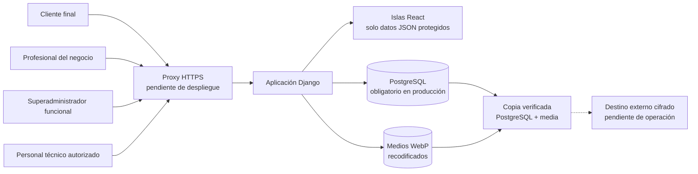

# Seguridad y protección de datos

## Propósito y alcance

Este documento reúne las medidas de seguridad aplicadas en AgendaSalon y las
evidencias que permiten verificarlas. Está preparado como base del apartado de
seguridad de la memoria del Proyecto Fin de Máster.

La revisión distingue tres estados:

- **Aplicado y verificado**: el control está implementado y dispone de pruebas o
  comprobaciones reproducibles.
- **Preparado para despliegue**: la aplicación incorpora la configuración, pero
  la comprobación definitiva necesita una URL pública con HTTPS.
- **Pendiente de operación**: depende de infraestructura, automatización o
  procedimientos que no deben fingirse en el entorno local.

Fecha de la evidencia: **11 de julio de 2026**.

Código funcional revisado: estado de la rama principal y bloque de cierre previo
al despliegue del 11 de julio de 2026.

## Arquitectura de seguridad



La aplicación separa cuatro superficies:

1. **Reserva pública por negocio**: permite explorar servicios y huecos sin
   mostrar la agenda interna. Exige una cuenta de cliente para confirmar.
2. **Panel profesional**: opera exclusivamente sobre el negocio asociado a la
   pertenencia activa del usuario.
3. **Panel superadministrador**: gestiona el ciclo de vida de los negocios, pero
   no actúa como profesional ni entra en la reserva de sus clientes.
4. **Django Admin**: herramienta técnica bajo `/admin/`, separada del producto y
   reservada a cuentas `is_staff` con permisos de modelo.

## Matriz de controles y evidencias

| Área | Control aplicado | Evidencia principal | Estado |
| --- | --- | --- | --- |
| Autenticación interna | Usuario Django propio con teléfono normalizado, sesión de Django y acceso condicionado por rol y pertenencia activa | `apps/accounts/`, `apps/accounts/tests.py` | Aplicado y verificado |
| Autenticación cliente | Cuenta ligada a una ficha y a un negocio; sesión separada, rotación al entrar y salir y caducidad tras una hora de inactividad | `apps/customers/services.py`, `apps/customers/tests.py` | Aplicado y verificado |
| Hashing | Argon2id como algoritmo preferente; actualización transparente de hashes PBKDF2 después de un acceso correcto | `config/settings/base.py`, pruebas de `apps/customers/tests.py` | Aplicado y verificado |
| Contraseñas | Mínimo de 12 caracteres y validadores de similitud, contraseñas comunes y valores exclusivamente numéricos | `config/settings/base.py`, formularios y pruebas de acceso | Aplicado y verificado |
| Fuerza bruta | Limitación por identidad e IP; claves seudonimizadas con HMAC-SHA-256 y limpieza operativa de contadores inactivos | `apps/core/security_throttle.py`, `prune_security_throttles` | Aplicado y verificado |
| Recuperación de acceso cliente | Invitación aleatoria de un solo uso, ligada a negocio y ficha, caducidad de 24 horas y token almacenado solo como resumen SHA-256 | `apps/customers/services.py`, `apps/customers/tests.py` | Aplicado y verificado |
| Autorización | Decoradores de acceso, comprobación de negocio activo y filtrado de objetos por empresa | vistas, API y pruebas de aislamiento | Aplicado y verificado |
| Aislamiento multiempresa | Los endpoints profesionales resuelven el negocio desde la sesión; no confían en un identificador de empresa enviado por el navegador | `apps/booking/api.py`, `apps/dashboards/api.py`, pruebas por negocio | Aplicado y verificado |
| CSRF | `CsrfViewMiddleware`, token en formularios y mutaciones mediante POST; pantalla de rechazo sin detalles internos | `config/settings/base.py`, plantillas y prueba CSRF real de activación | Aplicado y verificado |
| XSS y contenido activo | Autoescape de plantillas, ausencia de inserciones HTML inseguras en el código de producto y CSP con scripts limitados al mismo origen | `apps/core/middleware.py`, `config/settings/base.py` | Aplicado y verificado |
| Cabeceras de navegador | `Permissions-Policy`, CORP `same-origin`, bloqueo de marcos y objetos mediante CSP | middleware y pruebas de cabeceras | Aplicado y verificado |
| Validación | Formularios Django, `full_clean()`, normalización de teléfonos, restricciones de modelos y mensajes genéricos en accesos sensibles | formularios, modelos y 243 pruebas Django | Aplicado y verificado |
| Integridad de citas | Revalidación del hueco antes de guardar, transacciones atómicas y bloqueo de filas en transiciones concurrentes | `apps/booking/services.py`, `test_postgres_concurrency.py` | Aplicado y verificado |
| Subida de imágenes | JPG, PNG o WebP; 5 MB y 16 millones de píxeles; orientación, reducción a 2400 px y recodificación WebP sin EXIF | `apps/businesses/images.py`, pruebas de ajustes | Aplicado y verificado |
| Galería pública por negocio | Las imágenes propias se relacionan con un único negocio y el formulario solo permite seleccionar archivos de esa misma empresa | `BusinessPublicImage`, formulario de ajustes y pruebas de aislamiento | Aplicado y verificado |
| Secretos | Variables de entorno obligatorias en producción; arranque detenido si faltan secreto, hosts o PostgreSQL | `config/settings/prod.py`, `.env.example`, pruebas de producción | Aplicado y verificado |
| Base de datos | SQLite solo para desarrollo; PostgreSQL obligatorio en producción, conexión persistente con comprobación de salud | `config/settings/database.py`, `config/settings/prod.py` | Aplicado y verificado |
| HTTPS | Redirección a HTTPS, cookies seguras, orígenes CSRF configurables y HSTS inicial | `config/settings/prod.py` | Preparado para despliegue |
| Dependencias | Versiones fijadas; auditorías Python y Node sin vulnerabilidades conocidas en la fecha de revisión | `requirements.txt`, `package-lock.json`, comandos de evidencia | Aplicado y verificado |
| Copias | Copia de PostgreSQL y `media`, hashes SHA-256 y manifiesto autenticado con HMAC mediante clave separada; verificación previa y restauración protegida | `ops/backup_restore.py`, `ops/test_backup_restore.py` | Aplicado y verificado localmente |
| Destino externo de copias | Retención definida y requisito de almacenamiento cifrado fuera del servidor | `docs/OPERACION_PRODUCCION.md` | Pendiente de operación |

## Autenticación, sesiones y contraseñas

El acceso profesional y superadministrador utiliza el sistema de autenticación
de Django sobre un usuario personalizado. El teléfono se normaliza antes de
identificar la cuenta, evitando que diferentes formatos representen identidades
distintas.

Los clientes no comparten una cuenta global entre salones. Cada acceso queda
ligado a un negocio y a una ficha concreta. El registro público solo crea fichas
nuevas: si el teléfono ya existe, responde con un mensaje genérico y exige una
invitación emitida por el profesional. Así se evita que una persona se apropie
de una ficha existente conociendo únicamente su número.

Las contraseñas nuevas se almacenan con Argon2id. Django conserva PBKDF2 como
algoritmo compatible para poder verificar cuentas antiguas y actualizar su hash
después de un acceso correcto. Nunca se guardan contraseñas en claro.

Las sesiones usan cookies `HttpOnly` y `SameSite=Lax`. En producción se marcan
además como `Secure`. La sesión cliente rota su identificador al entrar y salir,
y el acceso caduca tras una hora sin actividad.

## Autorización y aislamiento por negocio

AgendaSalon aplica autorización en dos capas:

- la ruta exige una sesión y un rol válidos;
- cada consulta limita los objetos al negocio resuelto desde la pertenencia del
  usuario o desde el slug público correspondiente.

Las islas React no reciben acceso directo a la base de datos. Consumen endpoints
JSON de solo lectura, protegidos por sesión y con política de no caché. El
identificador del negocio no se acepta como fuente de autorización desde el
navegador.

El panel superadministrador y Django Admin no son equivalentes. El primero
pertenece al producto. El segundo es una consola técnica de mantenimiento: una
cuenta `is_staff` puede entrar, pero Django limita después cada modelo por
permisos; solo el superusuario dispone de acceso completo.

## CSRF, XSS y cabeceras

Todas las mutaciones construidas utilizan POST y token CSRF. El middleware de
Django valida el origen y el token antes de ejecutar la acción. Una prueba con
comprobación CSRF real cubre el flujo de activación por invitación.

Las plantillas utilizan el escape automático de Django. La revisión del código
no encuentra `mark_safe`, filtros `safe`, `dangerouslySetInnerHTML`, `innerHTML`,
`eval` ni ejecución dinámica equivalente en las superficies del producto.

La CSP de producto restringe scripts, conexiones, formularios y recursos al
mismo origen, salvo las fuentes declaradas. Bloquea objetos, marcos y atributos
JavaScript. Django Admin mantiene una excepción `unsafe-inline` únicamente para
scripts bajo `/admin/`, necesaria para su interfaz actual; esta excepción no se
propaga a profesionales ni clientes.

El producto todavía permite estilos inline para soportar valores visuales
calculados en algunas plantillas. Esta concesión no habilita scripts inline y
queda registrada como endurecimiento futuro de la CSP.

## Validación e integridad de la agenda

Los formularios y modelos validan tipos, longitudes, formatos, pertenencia y
reglas de negocio. Los números se normalizan, las citas usan fechas conscientes
de zona horaria y las restricciones de base de datos refuerzan las invariantes
que no deben depender solo de la interfaz.

La disponibilidad mostrada no garantiza por sí sola una reserva. Antes de crear
una cita, el servicio de dominio vuelve a calcular el hueco y lo bloquea dentro
de una transacción. En PostgreSQL, las transiciones concurrentes de una cita
usan `select_for_update()`. La prueba concurrente confirma que dos operaciones
incompatibles no pueden cerrar la misma cita con resultados distintos.

## Gestión de secretos y configuración de producción

El perfil `config.settings.prod` falla de forma explícita si no recibe:

- `DJANGO_SECRET_KEY`;
- `DJANGO_ALLOWED_HOSTS`;
- `DJANGO_DATABASE_URL`.

PostgreSQL es obligatorio en producción. La URL de conexión se obtiene del
entorno y no se pasa a la herramienta de copias mediante argumentos visibles en
la lista de procesos. `.env.example` contiene únicamente nombres y ejemplos sin
credenciales reales. Gitleaks no detectó secretos en el historial Git completo
existente en la fecha de revisión ni en los cambios preparados del bloque de
cierre.

## HTTPS: configuración preparada y evidencia pendiente

El perfil de producción activa:

- redirección obligatoria a HTTPS;
- cookies de sesión y CSRF seguras;
- HSTS inicial de 60 segundos e inclusión de subdominios;
- `upgrade-insecure-requests` dentro de la CSP;
- lista explícita de hosts y orígenes CSRF.

No se afirma que HTTPS esté validado porque la aplicación todavía no está
desplegada. `SECURE_HSTS_PRELOAD` permanece desactivado de manera deliberada. El
chequeo `manage.py check --deploy` solo informa de esa decisión. El preload no
debe activarse hasta confirmar dominio definitivo, certificado válido,
redirecciones correctas y estabilidad de todos los subdominios.

## Copias de seguridad y recuperación

La herramienta `ops/backup_restore.py` crea un volcado PostgreSQL, un archivo de
medios y un manifiesto con sumas SHA-256 autenticado con una clave HMAC separada
del almacenamiento. La restauración verifica primero integridad y autenticidad,
exige una confirmación explícita y no sobrescribe medios existentes
silenciosamente.

El ensayo realizado en PostgreSQL 17 restauró una copia en una base limpia y
comparó los recuentos de 2 negocios, 19 citas y 7 clientes. Los objetivos
iniciales son RPO de 24 horas, RTO inferior a 2 horas y retención de 7 copias
diarias, 4 semanales y 6 mensuales.

La automatización periódica y el destino externo cifrado siguen pendientes del
despliegue. El procedimiento está probado; la operación continua todavía no.

## Protección y minimización de datos

AgendaSalon trata datos identificativos y de contacto necesarios para gestionar
citas. El MVP excluye datos sanitarios. Las notas internas se limitan a
información operativa y no deben utilizarse para almacenar información sensible.

El historial de actividad conserva trazabilidad de acciones sin guardar
contraseñas, tokens en claro ni datos personales innecesarios. La actividad
global del superadministrador no muestra nombres ni teléfonos de clientes.
Las reservas públicas registran el actor genérico `Cliente online` y omiten del
detalle de cambios los nombres de quien solicita o recibe la cita. La migración
`businesses.0009` aplica la misma minimización a los eventos públicos ya
existentes, sin alterar la ficha de cita que necesita el profesional.

Estas medidas técnicas no sustituyen las obligaciones jurídicas de una
explotación comercial. Antes de producción deben cerrarse política de
privacidad, base jurídica, información al usuario, contratos con encargados,
plazos definitivos de conservación y procedimiento de ejercicio de derechos.

## Evidencias reproducibles

Los siguientes comandos se ejecutaron sobre el código funcional el 12 de julio
de 2026:

```powershell
.\.venv\Scripts\coverage.exe run manage.py test
.\.venv\Scripts\coverage.exe report
npm.cmd run check
.\.venv\Scripts\ruff.exe check .
.\.venv\Scripts\python.exe manage.py check
.\.venv\Scripts\python.exe manage.py makemigrations --check --dry-run
.\.venv\Scripts\python.exe -m pip_audit
npm.cmd audit --audit-level=low
gitleaks detect --source . --no-banner --redact --exit-code 1
```

| Comprobación | Resultado |
| --- | --- |
| Suite Django en SQLite | 243 pruebas correctas; 1 omitida por requerir PostgreSQL |
| Suite Django en PostgreSQL 17 | 243 pruebas correctas, incluida concurrencia real |
| Cobertura con ramas | 82 %; puerta mínima automatizada del 82 % |
| Suite frontend | 21 pruebas correctas: 17 unitarias y 4 de componentes React |
| Build Vite | Correcto; 19 módulos transformados |
| `manage.py check` | Sin incidencias |
| Migraciones | No se detectaron cambios pendientes |
| `pip-audit` | Sin vulnerabilidades conocidas |
| `npm audit` | 0 vulnerabilidades conocidas |
| Gitleaks 8.30.1 | Historial Git completo y cambios preparados revisados; sin secretos detectados |
| PostgreSQL 17 | Suite completa de 243 pruebas correcta, incluida concurrencia real |
| CI | GitHub Actions: Ruff, migraciones, cobertura, SQLite, PostgreSQL, frontend, auditorías y Gitleaks |
| Copia y restauración | Restauración completa en base limpia con recuentos coincidentes |

El chequeo de producción se ejecutó con valores locales temporales, sin
credenciales reales y sin conectar servicios externos:

```powershell
.\.venv\Scripts\python.exe manage.py check --deploy --settings=config.settings.prod
```

Resultado: una única advertencia, `security.W021`, porque HSTS preload permanece
desactivado hasta disponer de dominio y HTTPS estables.

## Riesgos residuales y puertas antes de producción

| Riesgo residual | Prioridad | Decisión o condición de cierre |
| --- | --- | --- |
| HTTPS todavía no comprobado en una URL pública | Bloqueante para producción | Validar certificado, redirecciones, cookies seguras, CSRF y cabeceras en el dominio definitivo |
| Terminación TLS del proxy todavía no definida | Bloqueante para producción | Evitar acceso directo al proceso Django y decidir si se configura `SECURE_PROXY_SSL_HEADER`; el proxy debe eliminar cualquier cabecera de protocolo enviada por el cliente |
| Copias sin destino externo cifrado ni tarea programada | Bloqueante para producción | Elegir destino, automatizar, alertar fallos y repetir una restauración desde la copia externa |
| Django Admin accesible desde Internet | Alta | Restringir por red, VPN o IP y usar cuentas técnicas personales con privilegios mínimos |
| Sin segundo factor para cuentas técnicas | Alta para explotación comercial | Incorporar MFA o proteger el acceso mediante identidad del proveedor o VPN |
| Límite de subidas aplicado al archivo, pero no por frecuencia | Media | Añadir límite por cuenta o proxy; pasar el procesamiento a un worker si aumenta el volumen |
| Sin monitorización central ni alertas operativas | Media | Definir logs estructurados, disponibilidad, errores, uso de disco y avisos de copias |
| `unsafe-inline` en scripts de Django Admin | Media y acotada | Mantener la excepción solo en `/admin/` y revisar nonce o hash si se personaliza la consola |
| Estilos inline permitidos en el producto | Baja | Sustituir valores inline por clases o variables controladas y retirar progresivamente `unsafe-inline` de las directivas de estilo |
| Política de privacidad y conservación definitiva no cerradas | Bloqueante para uso real con clientes | Completar la capa jurídica y operativa antes de recopilar datos reales |

## Veredicto

AgendaSalon supera el alcance técnico exigible para explicar autenticación,
hashing, validación, CSRF, XSS, permisos, secretos y copias de seguridad. Los
controles de aplicación están implementados y respaldados por pruebas.

La aplicación está **preparada para abrir la fase de despliegue**, pero no debe
presentarse todavía como **lista para producción**. HTTPS, restricciones de
infraestructura, destino externo de copias, monitorización y obligaciones de
protección de datos requieren evidencia en el entorno definitivo.
