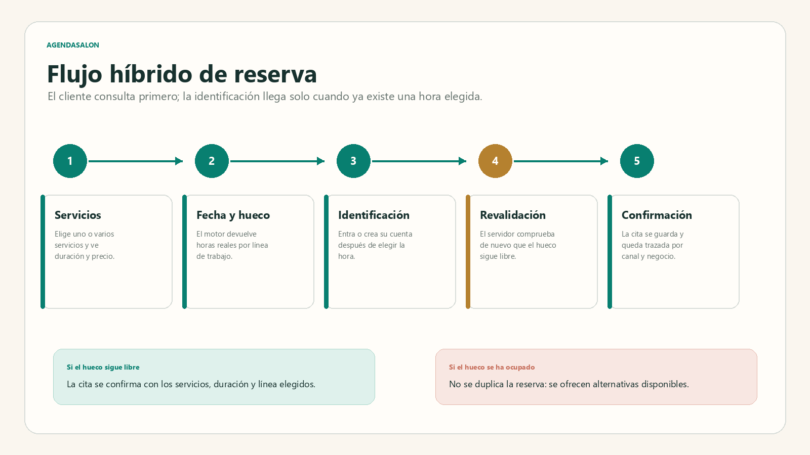
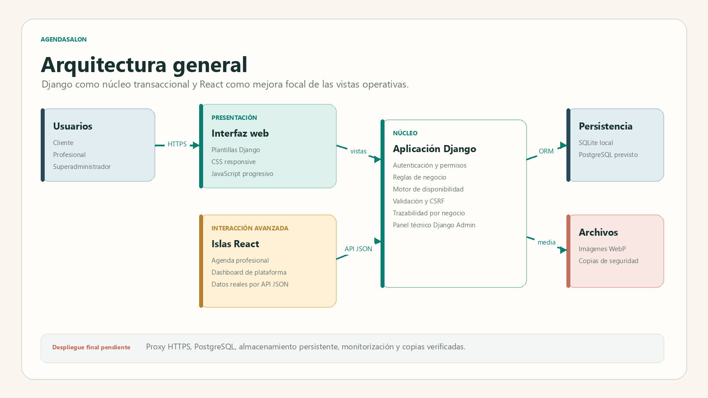
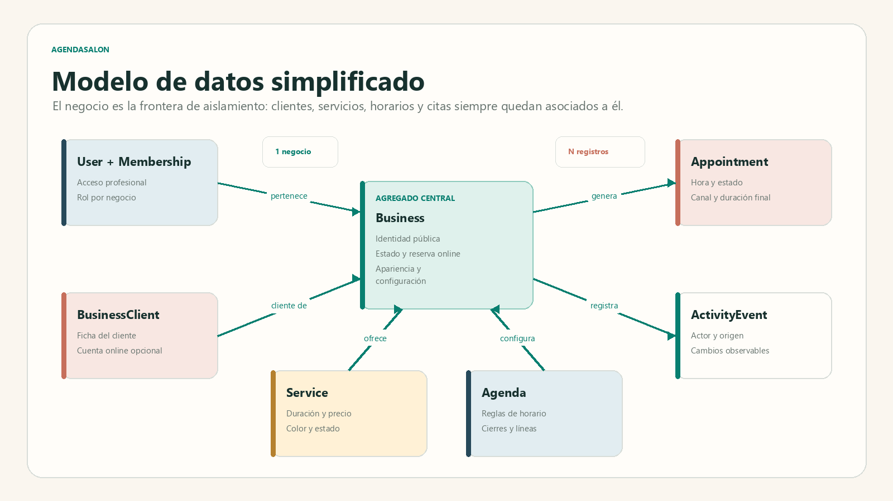
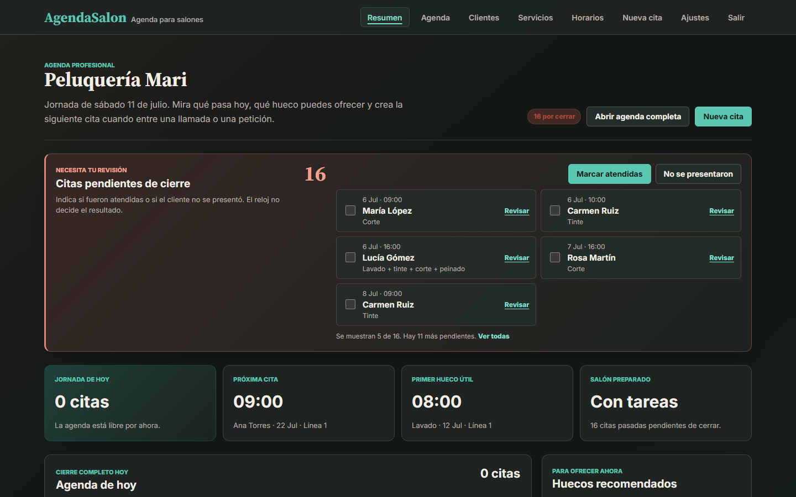
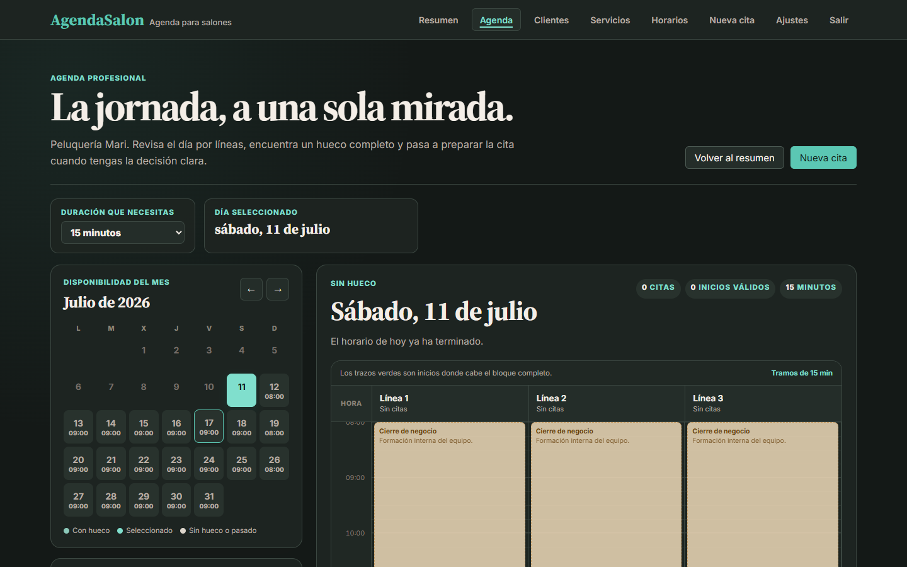
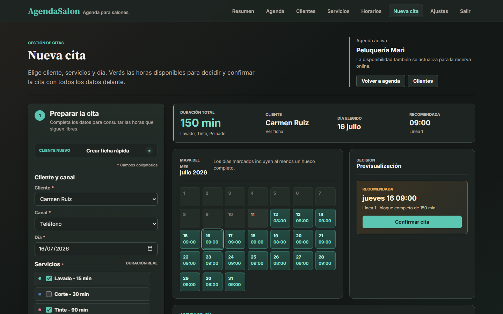
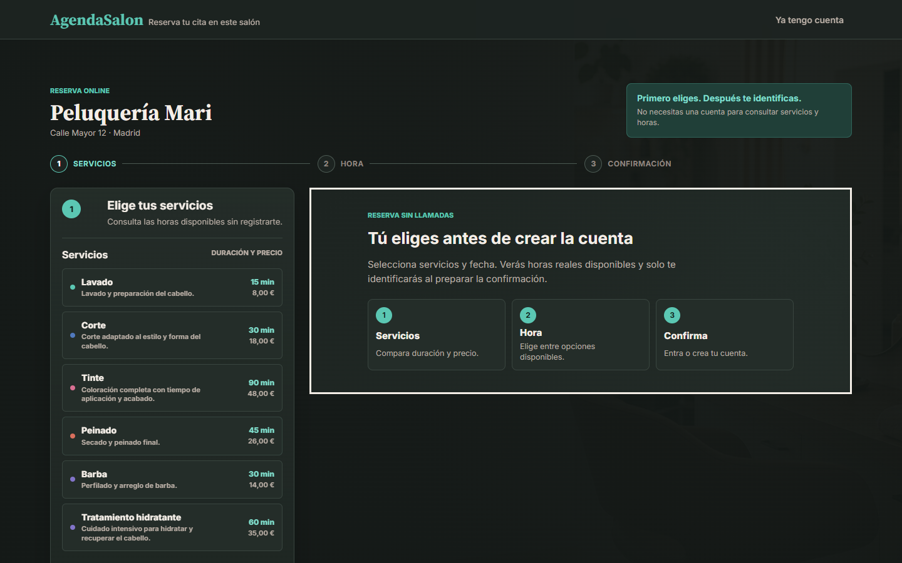
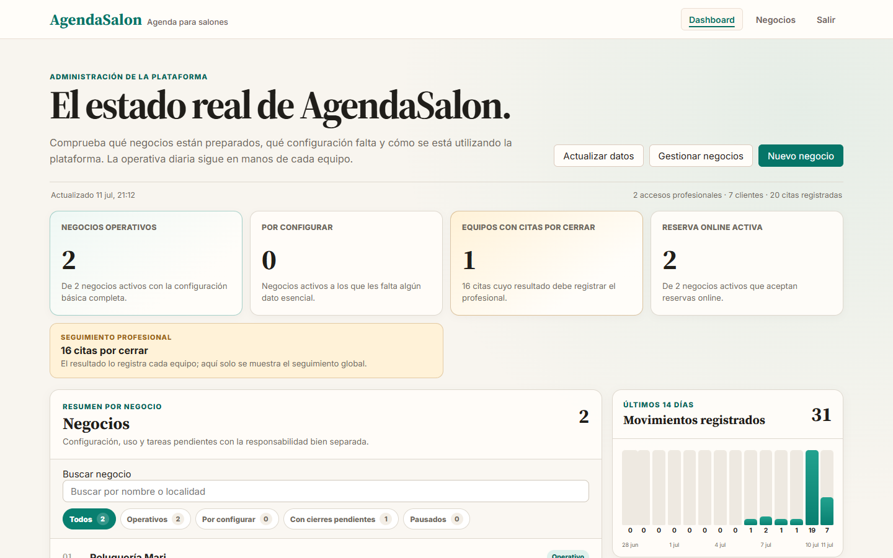
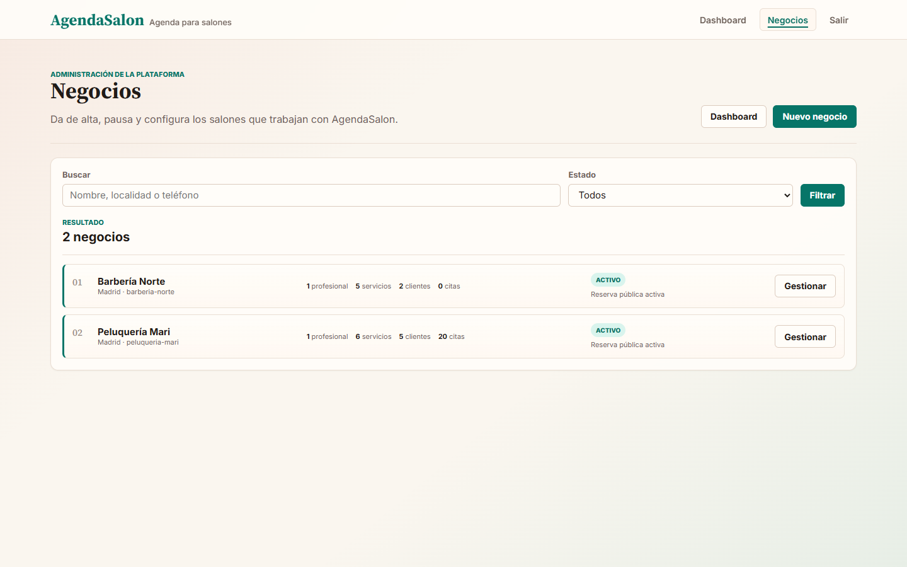

# AgendaSalon

## SaaS de gestión de citas para salones de belleza y barberías

**Proyecto Final de Máster — Desarrollo Full Stack**

**Alumno:** Fran Bravo

**Fecha:** julio de 2026
**Estado del documento:** versión técnica desplegada y verificable

---

## Resumen ejecutivo

AgendaSalon es una aplicación web multiempresa para organizar citas en salones de belleza, peluquerías, barberías y negocios análogos. El proyecto responde a un problema frecuente en pequeños establecimientos: la agenda se reparte entre llamadas, mensajes, anotaciones manuales y herramientas que no reflejan la duración real de cada servicio ni la capacidad simultánea del equipo.

La solución concentra en una misma plataforma la agenda profesional, la reserva online, la gestión de clientes, los servicios, los horarios, las líneas de trabajo y la supervisión de los negocios asociados. El producto aplica un enfoque **Django-first**: Django gobierna la autenticación, los permisos, las reglas de negocio y la persistencia, mientras que React se utiliza de manera contenida en dos vistas con alta densidad de interacción: la agenda profesional y el dashboard del superadministrador.

El resultado implementado incluye aislamiento por negocio, acceso profesional por teléfono, cuentas de cliente separadas por salón, motor de disponibilidad, reservas manuales y online, revalidación de huecos, trazabilidad operativa, personalización visual, modo oscuro y medidas específicas de seguridad. La demostración académica está desplegada en una URL pública con HTTPS, PostgreSQL, Gunicorn, Nginx, correo transaccional y copias locales verificadas. P2 quedó publicada y aceptada el 17 de julio de 2026 mediante la PR `#10`, la ejecución de CI `29589984747` y el SHA funcional `ed07e8e1d47eb55620df297636cd26ee10fe25c3`. El destino externo cifrado de las copias permanece identificado como riesgo residual y no se presenta como resuelto.

## 1. Introducción

La gestión de citas es una actividad central en los negocios de belleza y cuidado personal. Una decisión aparentemente sencilla —encontrar una hora libre— depende de varias condiciones: servicios elegidos, duración total, horario del local, cierres, capacidad simultánea, citas existentes y forma de atención del negocio.

AgendaSalon se plantea como un producto real y no como una demostración aislada. Por ello separa con claridad tres espacios:

1. La experiencia pública del cliente, asociada a la URL única de cada negocio.
2. El panel profesional, limitado al negocio al que pertenece la cuenta.
3. La administración de la plataforma, orientada al alta, configuración y seguimiento de negocios, sin invadir su operativa diaria.

El proyecto se ha construido de forma progresiva mediante Git. Cada bloque funcional mantiene pruebas, documentación y decisiones trazables. La aplicación utiliza datos de demostración reproducibles para facilitar su evaluación sin confundirlos con un entorno de producción.

## 2. Definición del problema

### 2.1 Contexto

En muchos salones pequeños la agenda se organiza con una combinación de teléfono, WhatsApp, papel y memoria del equipo. Incluso cuando existe una agenda digital, puede limitarse a bloques genéricos y no reflejar la duración acumulada de varios servicios o la capacidad real de varias líneas de trabajo.

### 2.2 Deficiencias del proceso habitual

- La información queda repartida entre canales distintos.
- El profesional debe sumar mentalmente la duración de los servicios.
- Es fácil ofrecer un hueco que no admite el bloque completo.
- La reserva online puede quedar desconectada de la agenda interna.
- Las citas pasadas pueden mantener un estado ambiguo si nadie registra su resultado.
- El responsable de la plataforma carece de una visión clara del estado de cada negocio.
- Una incidencia es difícil de reconstruir si no existe un historial de acciones.

### 2.3 Impacto

Estas deficiencias generan interrupciones, errores de planificación, huecos improductivos, solapamientos, llamadas innecesarias y una experiencia menos fiable para el cliente. También aumentan la carga cognitiva del profesional, que debe tomar decisiones rápidas mientras atiende el establecimiento.

### 2.4 Solución propuesta

AgendaSalon calcula la disponibilidad a partir de datos reales y presenta la información en el momento en que se necesita. El profesional puede crear una cita manual, ver la suma automática de la duración, ajustar el tiempo con un motivo y elegir entre huecos válidos. El cliente puede consultar servicios y horas antes de identificarse. El sistema revalida la disponibilidad inmediatamente antes de guardar.

## 3. Aportación y mejora de eficiencia

La aportación principal no consiste solo en digitalizar una agenda, sino en convertir datos dispersos en decisiones operativas claras.

| Situación anterior | Respuesta de AgendaSalon | Mejora esperada |
| --- | --- | --- |
| Suma manual de servicios | Duración acumulada reactiva | Menos errores y menor carga mental |
| Huecos estimados visualmente | Motor de disponibilidad por línea | Solo se ofrecen bloques completos |
| Reserva online separada | Misma disponibilidad para cliente y profesional | Coherencia entre canales |
| Cita pasada aún confirmada | Tarea explícita de cierre | Resultado real registrado por el equipo |
| Acciones difíciles de reconstruir | Registro de actividad por negocio | Diagnóstico y trazabilidad |
| Configuración técnica del color | Paleta visual de 30 tonalidades | Uso comprensible sin códigos hexadecimales |
| Imagen única por defecto | Dos fondos del sistema y galería propia | Personalización reutilizable por negocio |

## 4. Objetivos

### 4.1 Objetivo general

Construir una aplicación full stack segura y defendible que permita a varios negocios gestionar citas, clientes, servicios y disponibilidad sin mezclar sus datos ni sus responsabilidades.

### 4.2 Objetivos específicos

- Diseñar un modelo multiempresa con aislamiento por negocio.
- Implementar autenticación profesional y de cliente con sesiones separadas.
- Calcular huecos mediante duración, líneas, horarios, cierres y citas existentes.
- Permitir reservas manuales y online con revalidación antes de confirmar.
- Incorporar React donde aporta valor sin duplicar el dominio de negocio.
- Gestionar el ciclo de vida de negocios desde un panel de plataforma.
- Registrar acciones relevantes para soporte y auditoría funcional.
- Aplicar controles de seguridad, validación, protección de secretos y copias.
- Mantener una interfaz responsive, accesible y coherente en modo claro y oscuro.
- Documentar el proceso, las decisiones, las pruebas y las limitaciones reales.

## 5. Usuarios y roles

| Usuario | Necesidad principal | Alcance |
| --- | --- | --- |
| Visitante | Consultar servicios y horas | Solo información pública del negocio elegido |
| Cliente | Confirmar y gestionar su reserva | Cuenta ligada a una ficha y a un negocio |
| Profesional | Organizar agenda, clientes, servicios y horarios | Solo el negocio asociado a su pertenencia activa |
| Superadministrador funcional | Dar de alta, pausar y supervisar negocios | Plataforma, sin operar citas como profesional |
| Personal técnico autorizado | Mantener datos y resolver incidencias excepcionales | Django Admin con permisos técnicos explícitos |

La separación entre superadministrador funcional y administración técnica evita convertir la supervisión de la plataforma en acceso indiscriminado a la operativa de cada salón.

## 6. Casos de uso principales

### 6.1 Crear una cita desde el negocio

1. El profesional abre “Nueva cita”.
2. Selecciona cliente, canal y día.
3. Marca uno o varios servicios.
4. La aplicación muestra la duración acumulada en tiempo real.
5. Si es necesario, introduce una duración diferente y justifica el ajuste.
6. El sistema calcula huecos completos por línea de trabajo.
7. El profesional revisa la recomendación y confirma.
8. El servidor revalida el hueco y registra la cita.

### 6.2 Reserva online híbrida

El visitante consulta primero y se identifica después. De este modo no se obliga a crear una cuenta antes de conocer si existe una hora útil.



**Figura 1.** Flujo de reserva pública con revalidación antes de confirmar.

### 6.3 Reservar para otra persona: familia y cuidados

AgendaSalon separa la ficha de la persona atendida, la cuenta que entra por
internet y el permiso para reservar en nombre de otra persona. Esta decisión
evita que dos clientes compartan historial solo porque utilizan el mismo
teléfono o porque uno de ellos depende de otra persona para organizarse.

#### 6.3.1 María y Lucas: madre e hijo

María López tiene ficha propia y cuenta online. Su hijo Lucas López tiene otra
ficha, sin teléfono propio y sin cuenta digital. La ficha de Lucas muestra a
María como madre y persona autorizada para reservar online.

La semilla de Peluquería Mari crea dos cortes a la misma hora del lunes de
demostración: María ocupa una línea de trabajo y Lucas otra. Son dos citas y dos
historiales distintos. La cita de Lucas conserva además que fue solicitada por
María en calidad de madre. Cuando María entra en la reserva pública, el selector
`¿Para quién es la cita?` solo le ofrece su propia ficha y la de Lucas.

#### 6.3.2 Daniel y Rosa: cuidador y persona atendida

Daniel Vega es cliente del salón, dispone de cuenta online y figura como
cuidador autorizado de Rosa Martín. Rosa conserva su propia ficha y no necesita
usuario ni contraseña. La cita sembrada de Rosa queda en su historial, pero el
detalle profesional identifica a Daniel como la persona que realizó la reserva.

#### 6.3.3 Ana y Lucía: autorización solo presencial o telefónica

La ficha de Lucía Gómez conserva a Ana Gómez como madre y contacto externo. Ana
puede pedir una cita por teléfono o en el establecimiento, pero no aparece en la
reserva online porque no tiene una ficha vinculada ni una cuenta activa. Este
tercer supuesto demuestra que guardar un contacto no concede acceso digital de
forma automática.

Los tres casos utilizan datos ficticios reproducibles. El servidor comprueba el
permiso al mostrar las fichas disponibles y vuelve a validarlo antes de crear la
cita. Una autorización solo funciona dentro del negocio que la concedió.

### 6.4 Cerrar una cita pasada

El sistema no presupone que una cita fue atendida solo porque terminó su hora. La cita aparece como pendiente de cierre y el profesional registra uno de los resultados admitidos: atendida o no presentada. Esta decisión conserva la realidad operativa y evita datos falsos.

### 6.5 Configurar el negocio

El profesional puede gestionar servicios, duración, precio, color, horarios, cierres, líneas de trabajo, tema visual e imagen pública. Los colores se eligen mediante una paleta visual. Las imágenes públicas pueden seleccionarse entre dos fondos del sistema o entre los archivos que haya subido el propio negocio.

### 6.6 Supervisar la plataforma

El superadministrador consulta negocios operativos, configuración pendiente, reserva online, accesos y actividad registrada. Puede crear, editar, pausar o reactivar un negocio, pero no crea reservas en su nombre ni entra libremente en el panel profesional.

### 6.7 Solicitar el alta de un nuevo negocio

Un profesional sin cuenta accede desde el propio login a un formulario breve. La plataforma registra los datos mínimos, la información de privacidad leída y el canal de contacto, pero no crea una cuenta. El superadministrador revisa la solicitud y, cuando confirma el alta, reutiliza el formulario transaccional de negocio y primer profesional. El contacto privado no se publica por defecto.

## 7. Tecnologías utilizadas

| Tecnología | Uso | Justificación |
| --- | --- | --- |
| Python y Django 5.2 LTS | Backend, plantillas, autenticación, ORM y reglas | Madurez, seguridad integrada y rapidez de desarrollo |
| React 19 | Agenda y dashboard de plataforma | Interacción rica en superficies concretas |
| Vite | Compilación del frontend React | Construcción rápida y salida estática controlada |
| SQLite | Desarrollo local | Simplicidad y reproducibilidad |
| PostgreSQL | Producción activa | Concurrencia, bloqueos y operación robusta |
| Pillow | Tratamiento de imágenes | Verificación, orientación y recodificación segura |
| Argon2 | Hashing de contraseñas | Algoritmo resistente y preferente en la configuración |
| Git y GitHub | Historial y entrega de código | Trazabilidad progresiva y repositorio evaluable |
| Playwright | Validación visual y responsive | Prueba de vistas reales en escritorio y móvil |

## 8. Arquitectura

AgendaSalon utiliza una arquitectura web monolítica modular. Cada aplicación Django agrupa un ámbito del dominio: cuentas, negocios, clientes, reservas, paneles, festivos y notificaciones. Las vistas React consumen endpoints JSON protegidos por la misma sesión y las mismas reglas de autorización.



**Figura 2.** Arquitectura general implementada y verificada en producción.

### 8.1 Decisión Django-first

El núcleo permanece en Django para evitar duplicar validaciones en dos backends. React no decide si una cita es válida ni escribe directamente en la base de datos. La autoridad final corresponde al servidor.

### 8.2 Islas React

- **Agenda profesional:** calendario mensual, día seleccionado, líneas de trabajo, huecos y citas.
- **Dashboard de plataforma:** métricas, filtros, actividad y distribución de citas.

Esta integración demuestra React dentro de un producto completo sin convertir todas las páginas en una aplicación de una sola página innecesaria.

## 9. Modelo de datos

El negocio actúa como frontera de aislamiento. Las consultas profesionales obtienen el negocio desde la pertenencia activa del usuario y filtran cada entidad por esa relación.



**Figura 3.** Entidades principales y relación con el agregado Business.

Entre las entidades más relevantes se encuentran:

- `Business`: identidad, estado, reserva pública y apariencia.
- `BusinessMembership`: relación entre usuario profesional y negocio.
- `BusinessClient` y `BusinessClientAccess`: ficha y cuenta online del cliente.
- `BusinessClientAuthorizedContact` y `BusinessClientAccessGrant`: persona
  autorizada y permiso explícito para reservar para una ficha concreta.
- `Service`: duración, precio, color y estado del servicio.
- `AvailabilityRule`, `BusinessClosure` y `WorkLine`: capacidad de la agenda.
- `Appointment` y `AppointmentService`: cita y copia histórica de sus servicios.
- `BusinessActivityEvent`: registro append-only de hechos operativos.
- `BusinessPublicImage`: galería de imágenes propia y aislada por negocio.

## 10. Funcionalidades implementadas

### 10.1 Acceso profesional


**Figura 4.** Pantalla de acceso privado con jerarquía clara y datos de demostración separados del producto.

### 10.2 Resumen del negocio



**Figura 5.** Resumen operativo con citas pendientes de cierre, métricas y próximas decisiones.

### 10.3 Agenda React



**Figura 6.** Agenda profesional por día y líneas de trabajo.

### 10.4 Nueva cita



**Figura 7.** Preparación de una cita de 150 minutos, calendario de disponibilidad y recomendación legible en modo oscuro.

### 10.5 Reserva pública



**Figura 8.** Consulta de servicios antes de exigir identificación al cliente.

Tras confirmar, el cliente llega a un justificante con negocio, fecha, hora,
servicios, duración, precio y estado del correo. El justificante exige la misma
cuenta cliente, queda aislado por negocio y puede recargarse durante una hora.
No expone un historial completo ni citas de otras personas.

Si la cuenta dispone de permisos sobre varias fichas, la revisión muestra
`¿Para quién es la cita?`. El selector solo incluye la ficha propia y las
personas autorizadas por el negocio. La cita se guarda siempre en el historial
de quien recibe el servicio y conserva quién la solicitó y con qué relación.

### 10.6 Administración de la plataforma



**Figura 9.** Visión global de estado, configuración, actividad y uso.



**Figura 10.** Gestión del ciclo de vida de los negocios asociados.

### 10.7 Solicitudes de alta profesional

El dashboard incorpora el número de solicitudes pendientes. La bandeja protegida permite buscar, filtrar, registrar seguimiento y convertir cada solicitud en negocio. La conversión conserva el actor, la fecha y el negocio resultante, mientras que la privacidad conserva documento, versión y huella mostrados al solicitante.

## 11. Integración de React

La agenda React recibe una configuración inicial desde Django y consulta dos endpoints: disponibilidad mensual y detalle del día. El dashboard del superadministrador consulta datos agregados y permite buscar, filtrar y ordenar negocios sin recargar la página.

Los componentes no utilizan datos simulados en producción. Las respuestas se construyen con consultas del ORM y respetan la sesión, el rol y el negocio. La compilación genera archivos estáticos versionados que Django sirve junto con el resto de la interfaz.

## 12. Seguridad y protección de datos

La seguridad se ha tratado como una parte del diseño y no como una revisión posterior. El documento `docs/SEGURIDAD_Y_PROTECCION_DE_DATOS.md` conserva la matriz completa de controles y evidencias.

### 12.1 Autenticación y contraseñas

- Usuario profesional personalizado con teléfono normalizado.
- Cuenta de cliente ligada a un negocio concreto.
- Sesiones separadas para profesional y cliente.
- Argon2id como hasher preferente.
- Validación de longitud, similitud, contraseñas comunes y valores numéricos.
- Limitación de intentos por identidad e IP con claves seudonimizadas.
- Contraseña temporal obligatoria en accesos creados por superadministración.
- Cambio personal desde `Mi cuenta`, con comprobación de la contraseña actual.
- Conservación de la sesión presente e invalidación de las demás sesiones tras
  el cambio.

La contraseña pertenece a la cuenta profesional, no al negocio. El primer
acceso queda bloqueado antes del onboarding legal hasta que la persona sustituye
la credencial temporal conocida por el superadministrador. La misma superficie
permite cambios voluntarios posteriores y está disponible también para la cuenta
superadministradora. La recuperación autónoma por correo o SMS no se presenta
como disponible mientras el proyecto no disponga de un canal obligatorio y
verificado.

### 12.2 Autorización y aislamiento

- Comprobación de sesión y pertenencia activa.
- Filtrado de objetos por negocio en vistas y APIs.
- Separación entre profesional, superadministrador y personal técnico.
- Galería de imágenes propia: un negocio no puede seleccionar archivos de otro.

### 12.3 CSRF, XSS y navegador

- Middleware CSRF de Django y token en formularios.
- Mutaciones de formularios mediante POST. En la verificación del correo
  profesional, `GET` y `HEAD` son de solo lectura y no cambian el estado; la
  confirmación efectiva exige `POST` protegido por CSRF.
- Autoescape de plantillas.
- Política CSP y bloqueo de contenido activo no autorizado.
- `Permissions-Policy`, protección frente a marcos y política de recursos del mismo origen.

### 12.4 Validación e integridad

- Formularios Django y validación de modelos.
- Restricciones de base de datos.
- Transacciones atómicas.
- Revalidación del hueco antes de confirmar.
- Bloqueo de filas en operaciones concurrentes sobre PostgreSQL.

### 12.5 Imágenes

Las imágenes públicas admiten JPG, PNG o WebP, con máximo de 5 MB y 16 millones de píxeles. Se corrige la orientación, se limita el lado mayor a 2400 píxeles y se recodifica a WebP sin metadatos EXIF. Esta medida reduce el riesgo de archivos malformados, consumo excesivo y exposición involuntaria de metadatos.

### 12.6 Secretos, HTTPS y copias

Producción exige secreto, hosts, orígenes CSRF y PostgreSQL mediante variables de entorno. La configuración activa redirección HTTPS, cookies seguras y HSTS. Las copias incluyen base de datos y medios, manifiesto SHA-256 y verificación de restauración. En el despliegue público se han activado la copia diaria, la retención 7/4/6 y el control de una antigüedad máxima de 36 horas. El destino externo cifrado y la restauración desde él siguen pendientes.

## 13. Pruebas y calidad

La verificación actual incluye:

- 596 pruebas backend correctas en SQLite y 596 de 596 correctas en PostgreSQL
  17.
- 34 de 34 pruebas frontend correctas.
- 85 % de cobertura de ramas, por encima del umbral exigido.
- Compilación Vite de producción.
- Comprobación de migraciones pendientes.
- Auditorías de dependencias Python y Node sin vulnerabilidades conocidas en la fecha de revisión.
- Escaneo de secretos del historial Git.
- Auditoría visual de diez rutas profesionales en escritorio y móvil.
- Comprobación específica de contrastes, desbordes horizontales y consola.

La auditoría móvil se realizó con un viewport de 390 × 844 píxeles. No se detectaron desbordes horizontales reales, superficies claras accidentales ni errores de ejecución después de las correcciones.

## 14. Despliegue

### 14.1 Estado actual

La demostración académica está publicada desde el 14 de julio de 2026 en
`https://agendasalon.brvsoftwarestudio.com`. Usa PostgreSQL, Gunicorn por socket,
Nginx, HTTPS de Let's Encrypt, correo transaccional mediante Brevo y tareas
systemd para outbox y copias. El bloque P2 desplegado y aceptado corresponde al
SHA funcional `ed07e8e1d47eb55620df297636cd26ee10fe25c3`, integrado mediante la
PR `#10` después de superar la ejecución de CI `29589984747`.

### 14.2 Infraestructura verificada

- Configuración de producción separada.
- PostgreSQL obligatorio.
- Variables de entorno documentadas.
- Cabeceras y cookies seguras.
- Flujo de estáticos y medios.
- Scripts de copia, verificación y restauración.
- Comprobaciones de salud de base de datos.

### 14.3 Evidencias de despliegue incorporadas

1. URL pública operativa.
2. Certificado HTTPS válido.
3. `manage.py check --deploy` contra la configuración real.
4. Migraciones y `collectstatic` en el servidor.
5. Prueba de humo de accesos, reserva y paneles.
6. Copia local autenticada, retención 7/4/6 y vigilancia de frescura activas.
7. Proveedor, arquitectura y fecha documentados.

Permanece como riesgo de continuidad la copia externa cifrada y el ensayo de
restauración desde ese destino distinto del droplet.

## 15. Git, GitHub y evolución

El repositorio se encuentra en `https://github.com/fjbravo75/agendasalon`. El historial utiliza commits por bloques coherentes: base de dominio, motor de disponibilidad, reserva asistida, clientes, administración de plataforma, React, seguridad, personalización y documentación.

La estrategia evita tanto un único commit final como microcommits artificiales. Las correcciones visibles se registran como cambios reales, y cada bloque se acompaña de pruebas antes de su publicación.

## 16. Uso de inteligencia artificial

Durante el desarrollo se han utilizado herramientas de inteligencia artificial como apoyo al análisis, diseño técnico, generación inicial de código, revisión, documentación y validación de alternativas. Su uso no sustituye la toma de decisiones del desarrollador: la arquitectura, el alcance funcional, los criterios técnicos, la revisión del código, las pruebas y la integración final han sido responsabilidad del alumno.

## 17. Limitaciones y trabajo futuro

- Mantener la demo pública y repetir la prueba de humo tras cada despliegue.
- Ampliar las mediciones de concurrencia y rendimiento con carga representativa.
- Medir en uso real la cola de correo ya conectada a Brevo.
- Definir política operativa de retención y borrado de imágenes de la galería.
- Incorporar monitorización y alertas de disponibilidad.
- Medir tiempos de reserva y reducción de interrupciones con usuarios reales.
- Ampliar permisos profesionales si un negocio necesita varios roles internos.
- Permitir, en una evolución comercial, que una cuenta solicite al negocio el
  alta de una persona dependiente sin crearla unilateralmente.
- Incorporar una confirmación múltiple para familias sin mezclar las citas ni
  los historiales de cada persona.

## 18. Conclusiones

AgendaSalon demuestra una solución full stack completa, con backend dominante, integración React justificada, modelo multiempresa, interfaz cuidada y seguridad documentada. El producto traduce reglas complejas de agenda en decisiones comprensibles para profesionales y clientes.

La principal fortaleza del proyecto es la coherencia entre dominio, experiencia y seguridad: el mismo motor calcula disponibilidad para todos los canales; el servidor revalida antes de guardar; los roles no se mezclan; y el historial permite reconstruir acciones relevantes. El trabajo restante no consiste en inventar funcionalidad, sino en preparar la defensa, medir con más participantes y cerrar la continuidad externa.

## Anexo A. Comandos de evidencia

```text
python manage.py test --keepdb
npm run check
python manage.py makemigrations --check --dry-run
python manage.py check --deploy --settings=config.settings.prod
pip-audit -r requirements.txt
npm audit --omit=dev
gitleaks git --log-opts="--all"
```

## Anexo B. Rutas de demostración

| Superficie | Ruta local |
| --- | --- |
| Acceso profesional | `/entrar/` |
| Solicitud de alta profesional | `/solicitar-alta/` |
| Resumen profesional | `/profesional/` |
| Agenda React | `/profesional/agenda/` |
| Nueva cita | `/profesional/citas/nueva/` |
| Clientes | `/clientes/profesional/` |
| Ajustes | `/profesional/ajustes/` |
| Acceso cliente de Peluquería Mari | `/clientes/peluqueria-mari/entrar/` |
| Reserva de Peluquería Mari | `/reservar/peluqueria-mari/` |
| Reserva de Barbería Norte | `/reservar/barberia-norte/` |
| Dashboard de plataforma | `/superadmin/dashboard/` |
| Solicitudes de alta | `/superadmin/negocios/solicitudes/` |
| Django Admin técnico | `/admin/` |

## Anexo C. Fuentes del proyecto

- Guía oficial del Proyecto Final de Máster archivada con el proyecto.
- Contrato funcional de AgendaSalon.
- Arquitectura, modelo de datos y contrato técnico Django/React.
- Contrato gráfico y sistema visual.
- Dossier de seguridad y protección de datos.
- Historial Git y batería automatizada de pruebas.
